# PRD – Hệ thống VinhKhanhStreet (VKFoodTour)

> **Product Requirements Document**
> Dự án: Nền tảng Food Tour thông minh với audio guide đa ngôn ngữ cho phố ẩm thực
> Phiên bản: 1.0
> Ngày cập nhật: 21/04/2026

> **Phiên bản có ảnh sơ đồ đã render:** xem `docs/diagrams/PRD.Rendered.md` (đã thay tất cả khối Mermaid bằng PNG/SVG).
> **Render lại khi sửa file này:** chạy `pwsh -File docs/render-prd.ps1` từ thư mục gốc.

---

## 1. Tổng quan đồ án

### 1.1. Bối cảnh
Phố ẩm thực tại Việt Nam ngày càng phát triển và thu hút lượng lớn du khách trong và ngoài nước. Tuy nhiên, du khách thường gặp các vấn đề:
- Không hiểu được câu chuyện, văn hóa, lịch sử của từng quán.
- Rào cản ngôn ngữ khi đọc menu, biển hiệu, hỏi thông tin.
- Khó lựa chọn quán phù hợp do thiếu thông tin thống nhất.
- Trải nghiệm rời rạc, không có "sợi dây" dẫn dắt xuyên suốt tour.

Các giải pháp hiện có như Google Maps, TripAdvisor chỉ cung cấp thông tin tĩnh, không có trải nghiệm audio theo vị trí (location-based audio guide) và không hỗ trợ đa ngôn ngữ tự động cho từng quán nhỏ lẻ.

### 1.2. Mục tiêu sản phẩm
**VinhKhanhStreet (VKFoodTour)** là hệ thống trải nghiệm ẩm thực thông minh, bao gồm:
- **Web Admin**: nơi quản trị viên vận hành toàn bộ phố ẩm thực (POI, ngôn ngữ, audio, QR, thống kê).
- **Web Vendor**: nơi chủ quán tự quản lý gian hàng, thực đơn, media.
- **Mobile App**: ứng dụng dành cho du khách, quét QR đầu phố để bắt đầu tour audio đa ngôn ngữ, tự động thuyết minh theo vị trí GPS.

Mục tiêu cốt lõi:
1. Tạo trải nghiệm **audio tour tự động** theo geofence cho du khách.
2. Hỗ trợ **đa ngôn ngữ (i18n)** với dịch + TTS (Text-to-Speech) hàng loạt.
3. Hệ thống **QR-first**: một QR đầu phố khởi tạo toàn bộ tour, từng QR quán để xem chi tiết nhanh.
4. Cung cấp **dashboard thống kê realtime** phục vụ quản lý và quyết định kinh doanh.

### 1.3. Phạm vi & đối tượng sử dụng

| Đối tượng | Nền tảng | Vai trò chính |
|---|---|---|
| Admin | Web Admin (Blazor Server) | Quản trị toàn hệ thống, duyệt POI, cấu hình ngôn ngữ, tạo audio, quản lý QR, dịch nội dung |
| Vendor (chủ quán) | Web Vendor (cùng app Blazor, role `Vendor`) | Cập nhật thông tin quán, quản lý thực đơn, xem thống kê |
| Du khách (End-user) | Mobile App (.NET MAUI) | Quét QR, chọn ngôn ngữ, nghe audio theo vị trí, đánh giá |

### 1.4. Kiến trúc tổng thể

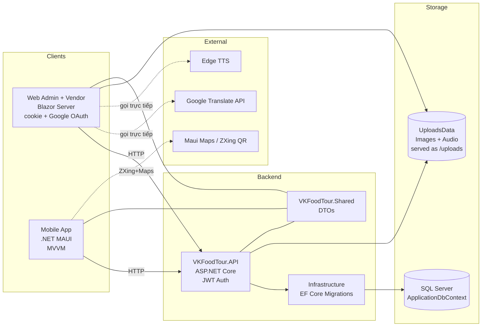
```mermaid
flowchart LR
    subgraph Clients
        A[Web Admin + Vendor<br/>Blazor Server<br/>cookie + Google OAuth]
        M[Mobile App<br/>.NET MAUI<br/>MVVM]
    end

    subgraph Backend
        API[VKFoodTour.API<br/>ASP.NET Core<br/>JWT Auth]
        INF[Infrastructure<br/>EF Core Migrations]
        SH[VKFoodTour.Shared<br/>DTOs]
    end

    subgraph External
        GT[Google Translate API]
        ETTS[Edge TTS]
        MAP[Maui Maps / ZXing QR]
    end

    subgraph Storage
        DB[(SQL Server<br/>ApplicationDbContext)]
        FS[(UploadsData<br/>Images + Audio<br/>served as /uploads)]
    end

    A -- HTTP --> API
    M -- HTTP --> API
    API --> INF
    INF --> DB
    API --> FS
    A -. gọi trực tiếp .-> GT
    A -. gọi trực tiếp .-> ETTS
    A --> FS
    API --- SH
    A --- SH
    M --- SH
    M -. ZXing+Maps .-> MAP
```

> **Ghi chú kiến trúc thực tế**
> - Nghiệp vụ được đặt trực tiếp trong Controller của API và trong `Admin/Services/` (không dùng CQRS/MediatR).
> - Google Translate và Edge TTS được gọi từ Web Admin (khi Admin soạn nội dung), không phải từ API runtime.
> - Không có SignalR hub nghiệp vụ – dashboard realtime dựa trên polling tracking log.

---

## 2. Use-case tổng quan

**Mô tả:** Sơ đồ use-case gom toàn bộ chức năng của hệ thống theo **3 actor** chính: Admin, Vendor, Du khách. Đây là cái nhìn tổng quan về phạm vi đồ án trước khi đi vào chi tiết từng module.

```mermaid
flowchart LR
    Admin(["👤 Admin"])
    Vendor(["👤 Vendor"])
    User(["👤 Du khách"])

    subgraph Sys["Hệ thống VKFoodTour"]
        direction TB
        subgraph UC_Admin["Chức năng Admin"]
            direction TB
            UA1([Đăng nhập<br/>cookie + Google])
            UA2([Dashboard<br/>thống kê])
            UA3([Quản lý POI<br/>CRUD + duyệt])
            UA4([Bản đồ POI])
            UA5([Quản lý ngôn ngữ<br/>+ TTS voice])
            UA6([Dịch tự động<br/>Google Translate])
            UA7([Soạn audio intro<br/>Edge TTS])
            UA8([Soạn thuyết minh<br/>POI đa ngôn ngữ])
            UA9([Quản lý file<br/>audio tổng])
            UA10([Quản lý QR<br/>tour + POI])
            UA11([Quản lý nhân sự<br/>& Vendor])
            UA12([Theo dõi heatmap<br/>+ tracking log])
            UA13([Xem phản hồi<br/>từ app])
        end

        subgraph UC_Vendor["Chức năng Vendor"]
            direction TB
            UV1([Cập nhật<br/>thông tin quán])
            UV2([Quản lý<br/>thực đơn])
            UV3([Xem thống kê<br/>tương tác])
        end

        subgraph UC_User["Chức năng Mobile"]
            direction TB
            UM1([Onboarding<br/>chọn ngôn ngữ])
            UM2([Đăng nhập<br/>đăng ký])
            UM3([Quét QR<br/>tour hoặc POI])
            UM4([Bắt đầu tour<br/>+ tải audio queue])
            UM5([Phát audio<br/>điều khiển player])
            UM6([Geofence<br/>tự động phát])
            UM7([Xem danh sách<br/>& chi tiết quán])
            UM8([Bản đồ toàn tour])
            UM9([Đánh giá quán])
            UM10([Yêu thích quán])
            UM11([Gửi phản hồi<br/>ứng dụng])
            UM12([Gửi tracking log])
        end
    end

    Admin --- UA1 & UA2 & UA3 & UA4 & UA5
    Admin --- UA6 & UA7 & UA8 & UA9 & UA10
    Admin --- UA11 & UA12 & UA13

    Vendor --- UA1
    Vendor --- UV1 & UV2 & UV3

    User --- UM1 & UM2 & UM3 & UM4 & UM5
    User --- UM6 & UM7 & UM8 & UM9 & UM10
    User --- UM11 & UM12
```

**Ghi chú:**
- Admin và Vendor **dùng chung hệ thống đăng nhập** (UA1) – phân quyền theo role.
- Chức năng "Quản lý POI" (UA3) **include** use-case "Duyệt POI" (Pending → Approved/Rejected) – chi tiết trạng thái xem ở sơ đồ State Lifecycle (STATE-01).
- Các use-case **dạng CRUD** (UA3, UA8, UA11, UV1, UV2) đều tuân theo pattern chung – xem sơ đồ SEQ-08 (CRUD generic).

---

## 3. Chức năng nổi bật

### 3.1. Web Admin
(Các trang Blazor tương ứng ghi chú trong cột **Route**)

| # | Chức năng | Route / File | Mô tả ngắn |
|---|---|---|---|
| A1 | **Đăng nhập / Đăng xuất** | `/login`, `/logout` | Xác thực bằng cookie, hỗ trợ Google OAuth. |
| A2 | **Dashboard thống kê** | `/` (`Home.razor`) | Tổng hợp QR scan, tương tác hôm nay, top POI, ngôn ngữ, đánh giá; realtime thiết bị qua `ActiveDevicesWidget` (poll EF). Component `OnlineUsersWidget` có trong codebase nhưng chưa gắn trang chủ. |
| A3 | **Quản lý POI / gian hàng** | `/admin/pois` (`PoiList.razor` + `PoiService`) | Tìm kiếm, lọc trạng thái, duyệt/ từ chối, chỉnh sửa thông tin, tọa độ, bán kính geofence. |
| A4 | **Bản đồ POI** | `/admin/ban-do` (`BanDoPoi.razor`) | Hiển thị toàn bộ POI trên bản đồ kèm vị trí & vùng geofence. |
| A5 | **Quản lý ngôn ngữ** | `/quan-ly-ngon-ngu` (`QuanLyNgonNgu.razor`) | Thêm/xóa/bật-tắt ngôn ngữ, cấu hình mã ngôn ngữ và TTS voice tương ứng. |
| A6 | **Dịch tự động nội dung POI** | `PoiList` + `GoogleTranslateService` | Dịch nội dung POI sang ngôn ngữ đích qua Google Cloud Translation API. |
| A7 | **Quản lý audio intro tour** | `/admin/intro-audio` (`IntroAudio.razor`) | Soạn nội dung intro phố ẩm thực, sinh audio theo từng ngôn ngữ bằng Edge TTS. |
| A8 | **Quản lý thuyết minh POI** | `/thuyet-minh` (`ThuyetMinh.razor`) | Soạn nội dung thuyết minh cho mỗi POI theo ngôn ngữ, sinh audio, theo dõi trạng thái đã có audio hay chưa. |
| A9 | **Quản lý audio tổng** | `/admin/audio-management` (`AudioManagement.razor`) | Danh sách tất cả audio (intro + POI), trạng thái, tái tạo / xóa. |
| A10 | **Quản lý QR** | `/ma-qr` (`MaQR.razor`) | Tạo & quản lý QR tour tổng (đầu phố) và QR từng POI; resolve qua API `Qr/resolve/{token}`. |
| A11 | **Quản lý nhân sự & Vendor** | `/nguoi-dung` (`NguoiDung.razor`) | Tạo/khóa tài khoản Admin, Vendor; gán Vendor với POI. |
| A12 | **Gian hàng (nội bộ)** | `/gian-hang` (`GianHang.razor`) | Trang thao tác gian hàng phía admin. |
| A13 | **Phản hồi từ app** | `/admin/phan-hoi-app` (`AppFeedback.razor`) | Xem feedback du khách gửi từ Mobile (API `Feedback/app`). |
| A14 | **Heatmap & Tracking log** | `/admin/ban-do` (`BanDoPoi.razor`) + Mobile → API `Tracking` | Heatmap: Blazor đọc `TrackingLogs` qua EF (bucket tọa độ), không qua HTTP nội bộ. Log vẫn do Mobile POST `/api/Tracking/log`. |

### 3.2. Web Vendor
(Cùng app Blazor `Admin/`, hiển thị theo role `Vendor`)

| # | Chức năng | Route / File | Mô tả ngắn |
|---|---|---|---|
| V1 | **Cập nhật thông tin quán** | `/vendor/thong-tin` (`Vendor/ThongTinQuan.razor`) | Sửa tên, mô tả, địa chỉ, tọa độ, ảnh đại diện / gallery. Sau khi lưu, trạng thái POI chuyển Pending chờ admin duyệt. |
| V2 | **Quản lý thực đơn** | `/vendor/thuc-don` (`Vendor/ThucDon.razor` + `MenuService`) | CRUD món ăn: tên, mô tả, giá, ảnh, danh mục (`MenuItem.Category`). |
| V3 | **Thống kê tương tác** | `/vendor/thu-nhap` (`Vendor/ThuNhap.razor`) | Xem lượt quét QR, lượt tương tác của quán (không có doanh thu do chưa tích hợp thanh toán). |

### 3.3. Mobile App (.NET MAUI)

| # | Chức năng | Trang / Service | Mô tả ngắn |
|---|---|---|---|
| M1 | **Onboarding & chọn ngôn ngữ** | `WelcomePage`, `LanguagePickerPage`, `SettingsService` | Màn chào + chọn ngôn ngữ giao diện/audio, lưu vào `SettingsService`. |
| M2 | **Đăng nhập / đăng ký du khách** | `LoginPage`, `AuthSessionService`, API `Auth/login`, `Auth/register` | Tài khoản `User` để gửi đánh giá/feedback. |
| M3 | **Quét QR đầu phố & QR quán** | `QrScanPage` (ZXing) → API `Qr/resolve/{token}` | Khởi động tour hoặc mở trực tiếp chi tiết quán. |
| M4 | **Bắt đầu tour & tải audio queue** | `TourPlayerPage` → API `Tour/start`, `Tour/audio-queue` | Tải intro + danh sách audio POI theo ngôn ngữ đã chọn. |
| M5 | **Phát audio** | `PlayerPage`, `AudioPlaybackService` (Plugin.Maui.Audio) | Play/Pause/Seek audio intro và thuyết minh POI. |
| M6 | **Geofence tự động (có dwell/exit debounce)** | `GeofenceMonitorService` | Poll GPS mỗi 3s, chỉ fire `PoiEntered` khi du khách **ở trong vùng liên tục 8s** (dwell), xác nhận `PoiExited` sau **10s ngoài vùng** (debounce). Bán kính tính từ `PoiRadiusMeters` + buffer 10m GPS. |
| M7 | **Audio queue thông minh với ngưỡng ưu tiên 60%** | `AudioQueueService` | Khi đang phát 1 POI mà đi vào vùng POI mới: • track hiện tại **≥ 60%** → `InsertNext` (chèn POI mới phát kế tiếp). • track hiện tại **< 60%** → `InterruptAndPlay` (ngắt ngay, phát POI mới, xếp track cũ phát lại sau). Đảm bảo không phát đè, xử lý được cả trường hợp đứng giữa 2 geofence. |
| M8 | **Danh sách & chi tiết gian hàng** | Tab `Gian hàng`, `StallDetailPage` → API `Poi`, `Poi/{id}/detail` | Hiển thị thông tin quán (đã localize), menu, ảnh. |
| M9 | **Bản đồ toàn tour** | `FullMapPage` (Maui Maps) | Hiển thị vị trí người dùng + toàn bộ POI. |
| M10 | **Đánh giá quán** | `StallDetailPage` → API `Reviews` | Gửi rating + nội dung review cho POI. |
| M11 | **Yêu thích** | `FavoriteService` | Lưu danh sách POI yêu thích (lưu cục bộ). |
| M12 | **Tracking log** | `DataService.TrackEventAsync` → API `Tracking/log` | Gửi event `qr_scan`, `enter`, `exit`, `listen_start`, `listen_end`. |
| M13 | **Đa ngôn ngữ giao diện** | `LocalizationService`, `TranslationStrings` | Đổi ngôn ngữ UI tại runtime. |
| M14 | **Gửi phản hồi ứng dụng** | API `Feedback/app` | Người dùng gửi feedback tổng thể cho admin. |
| M15 | **Cache ảnh** | `HttpImageService` | Cache ảnh trong bộ nhớ với TTL, giảm tải mạng. |

### 3.4. Điểm nổi bật của đồ án
- **Location-based audio guide**: audio thuyết minh tự động phát theo GPS/geofence, khác biệt với các app du lịch bấm-mới-nghe.
- **Pipeline dịch + TTS khép kín trên Web Admin**: admin nhập tiếng Việt → Google Translate sang ngôn ngữ đích → Edge TTS sinh audio → lưu vào `UploadsData` và liên kết với POI.
- **Smart Audio Queue** (`AudioQueueService`): xử lý hàng đợi audio khi đi qua nhiều POI hoặc đứng giữa các vùng geofence chồng lấn – ưu tiên theo **tiến độ track (60%)** thay vì khoảng cách, kết hợp **dwell 8s + exit debounce 10s** ở `GeofenceMonitorService` để tránh "nháy" do GPS nhiễu.
- **QR-first onboarding**: một QR đầu phố đủ để khởi tạo toàn bộ tour, không cần đăng ký trước.
- **Tracking đầy đủ hành vi** (`Tracking/log`) phục vụ heatmap, đếm thiết bị online, thống kê tỉ lệ hoàn thành tour.

---

## 4. Sơ đồ Sequence (tuần tự)

### 4.1. SEQ-01 – Du khách quét QR và bắt đầu tour

**Mô tả:** Mô tả luồng từ khi du khách quét QR tại cổng phố ẩm thực đến khi audio intro được phát. Đây là luồng "onboarding" quan trọng nhất quyết định trải nghiệm đầu tiên.

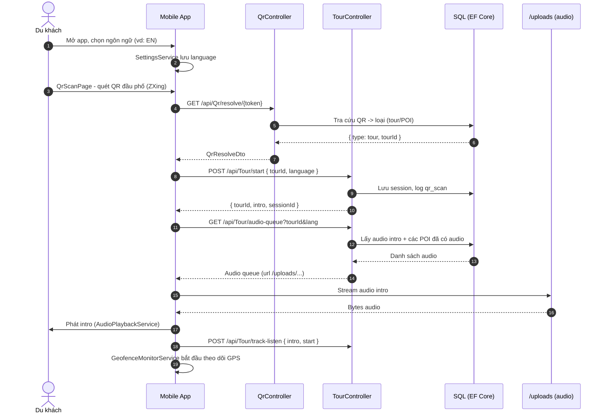
```mermaid
sequenceDiagram
    autonumber
    actor U as Du khách
    participant App as Mobile App
    participant Qr as QrController
    participant Tour as TourController
    participant DB as SQL (EF Core)
    participant FS as /uploads (audio)

    U->>App: Mở app, chọn ngôn ngữ (vd: EN)
    App->>App: SettingsService lưu language
    U->>App: QrScanPage - quét QR đầu phố (ZXing)
    App->>Qr: GET /api/Qr/resolve/{token}
    Qr->>DB: Tra cứu QR -> loại (tour/POI)
    DB-->>Qr: { type: tour, tourId }
    Qr-->>App: QrResolveDto
    App->>Tour: POST /api/Tour/start { tourId, language }
    Tour->>DB: Lưu session, log qr_scan
    Tour-->>App: { tourId, intro, sessionId }
    App->>Tour: GET /api/Tour/audio-queue?tourId&lang
    Tour->>DB: Lấy audio intro + các POI đã có audio
    DB-->>Tour: Danh sách audio
    Tour-->>App: Audio queue (url /uploads/...)
    App->>FS: Stream audio intro
    FS-->>App: Bytes audio
    App->>U: Phát intro (AudioPlaybackService)
    App->>Tour: POST /api/Tour/track-listen { intro, start }
    App->>App: GeofenceMonitorService bắt đầu theo dõi GPS
```

**Điểm quan trọng:**
- QR token luôn đi qua `Qr/resolve` để tránh lộ dữ liệu POI.
- Audio url là đường dẫn tĩnh `/uploads/...` (ASP.NET `UseStaticFiles`).
- `Tour/track-listen` ghi lại việc bắt đầu phát intro.

---

### 4.2. SEQ-02 – Tự động phát audio khi vào vùng geofence POI

**Mô tả:** Cơ chế geofence trigger tự động – mobile poll GPS mỗi 3s, phải ở trong vùng POI **liên tục 8 giây** (dwell) mới phát audio để tránh giật do GPS nhiễu. Khi kết thúc tự nhiên, audio kế tiếp được lấy từ queue.

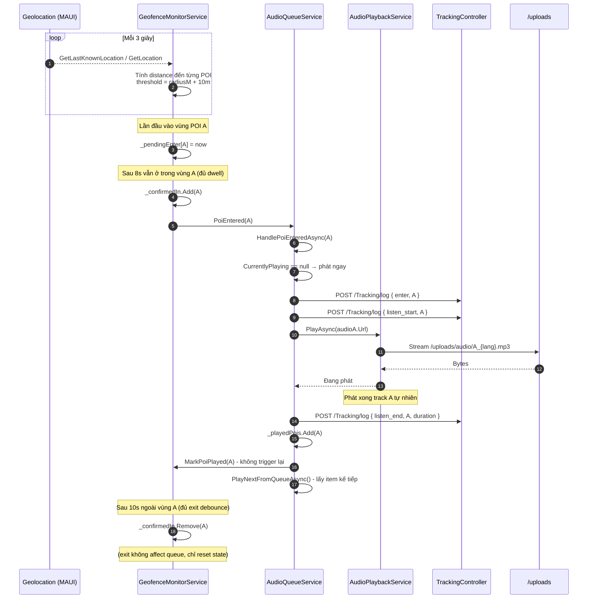
```mermaid
sequenceDiagram
    autonumber
    participant GPS as Geolocation (MAUI)
    participant Geo as GeofenceMonitorService
    participant Q as AudioQueueService
    participant Play as AudioPlaybackService
    participant Track as TrackingController
    participant FS as /uploads

    loop Mỗi 3 giây
        GPS-->>Geo: GetLastKnownLocation / GetLocation
        Geo->>Geo: Tính distance đến từng POI<br/>threshold = radiusM + 10m
    end

    Note over Geo: Lần đầu vào vùng POI A
    Geo->>Geo: _pendingEnter[A] = now

    Note over Geo: Sau 8s vẫn ở trong vùng A (đủ dwell)
    Geo->>Geo: _confirmedIn.Add(A)
    Geo->>Q: PoiEntered(A)

    Q->>Q: HandlePoiEnteredAsync(A)
    Q->>Q: CurrentlyPlaying == null → phát ngay
    Q->>Track: POST /Tracking/log { enter, A }
    Q->>Track: POST /Tracking/log { listen_start, A }
    Q->>Play: PlayAsync(audioA.Url)
    Play->>FS: Stream /uploads/audio/A_{lang}.mp3
    FS-->>Play: Bytes
    Play-->>Q: Đang phát

    Note over Play: Phát xong track A tự nhiên
    Q->>Track: POST /Tracking/log { listen_end, A, duration }
    Q->>Q: _playedPois.Add(A)
    Q->>Geo: MarkPoiPlayed(A) - không trigger lại
    Q->>Q: PlayNextFromQueueAsync() - lấy item kế tiếp

    Note over Geo: Sau 10s ngoài vùng A (đủ exit debounce)
    Geo->>Geo: _confirmedIn.Remove(A)
    Note over Geo: (exit không affect queue, chỉ reset state)
```

**Điểm quan trọng:**
- **Dwell 8s** ngăn false-positive khi du khách đi ngang qua quán mà không dừng.
- POI đã phát xong được đánh dấu `_playedPois` → không re-trigger dù du khách quay lại.
- Trường hợp **đứng giữa 2 geofence** được mô tả riêng ở SEQ-07.

---

### 4.3. SEQ-03 – Admin dịch nội dung POI + sinh audio bằng Edge TTS

**Mô tả:** Trên Web Admin, từ trang `ThuyetMinh.razor`, admin soạn nội dung tiếng Việt của 1 POI, dịch sang các ngôn ngữ đích (Google Translate), sau đó sinh audio (Edge TTS) và lưu file vào thư mục `UploadsData/` để API phục vụ qua `/uploads`.

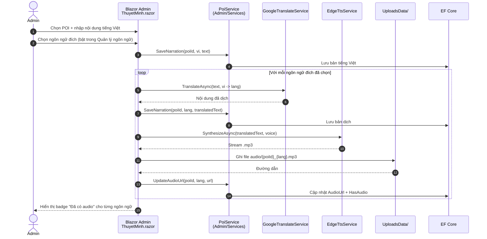
```mermaid
sequenceDiagram
    autonumber
    actor Ad as Admin
    participant W as Blazor Admin<br/>ThuyetMinh.razor
    participant PS as PoiService<br/>(Admin/Services)
    participant GT as GoogleTranslateService
    participant TTS as EdgeTtsService
    participant FS as UploadsData/
    participant DB as EF Core

    Ad->>W: Chọn POI + nhập nội dung tiếng Việt
    Ad->>W: Chọn ngôn ngữ đích (bật trong Quản lý ngôn ngữ)
    W->>PS: SaveNarration(poiId, vi, text)
    PS->>DB: Lưu bản tiếng Việt

    loop Với mỗi ngôn ngữ đích đã chọn
        W->>GT: TranslateAsync(text, vi -> lang)
        GT-->>W: Nội dung đã dịch
        W->>PS: SaveNarration(poiId, lang, translatedText)
        PS->>DB: Lưu bản dịch
        W->>TTS: SynthesizeAsync(translatedText, voice)
        TTS-->>W: Stream .mp3
        W->>FS: Ghi file audio/{poiId}_{lang}.mp3
        FS-->>W: Đường dẫn
        W->>PS: UpdateAudioUrl(poiId, lang, url)
        PS->>DB: Cập nhật AudioUrl + HasAudio
    end

    W-->>Ad: Hiển thị badge "Đã có audio" cho từng ngôn ngữ
```

**Điểm quan trọng:**
- Hoạt động **trong Blazor Server** (không qua API runtime) – tận dụng server-side để gọi Google Translate và Edge TTS.
- Mỗi ngôn ngữ tương ứng một **voice** được cấu hình ở `QuanLyNgonNgu.razor`.
- File audio lưu vào `UploadsData/` (shared với API để phục vụ qua `/uploads`).

---

### 4.4. SEQ-04 – Vendor cập nhật gian hàng & Admin duyệt

**Mô tả:** Vendor đăng nhập cùng Blazor app, sửa thông tin quán và thực đơn. Admin duyệt trong `PoiList.razor`. Mobile app chỉ nhận POI ở trạng thái Approved qua `Poi` API.

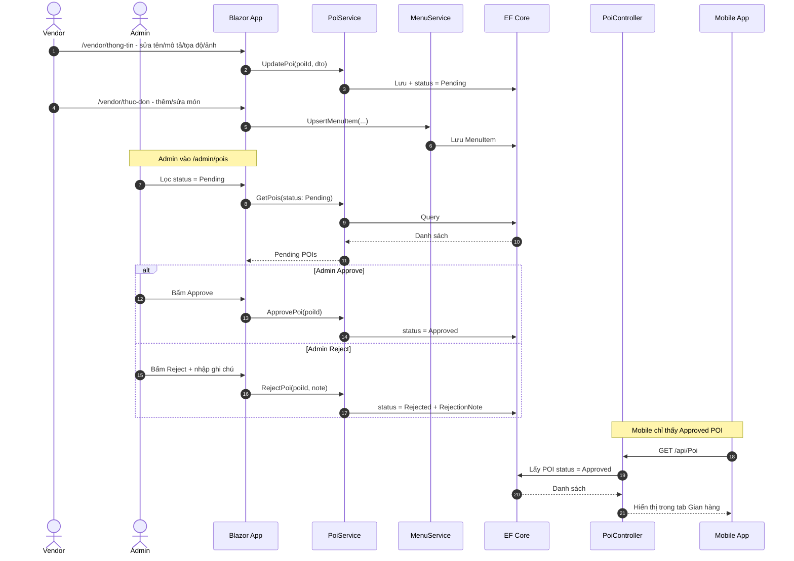
```mermaid
sequenceDiagram
    autonumber
    actor V as Vendor
    actor Ad as Admin
    participant B as Blazor App
    participant PS as PoiService
    participant MS as MenuService
    participant DB as EF Core
    participant API as PoiController
    participant M as Mobile App

    V->>B: /vendor/thong-tin - sửa tên/mô tả/tọa độ/ảnh
    B->>PS: UpdatePoi(poiId, dto)
    PS->>DB: Lưu + status = Pending

    V->>B: /vendor/thuc-don - thêm/sửa món
    B->>MS: UpsertMenuItem(...)
    MS->>DB: Lưu MenuItem

    Note over Ad,B: Admin vào /admin/pois
    Ad->>B: Lọc status = Pending
    B->>PS: GetPois(status: Pending)
    PS->>DB: Query
    DB-->>PS: Danh sách
    PS-->>B: Pending POIs

    alt Admin Approve
        Ad->>B: Bấm Approve
        B->>PS: ApprovePoi(poiId)
        PS->>DB: status = Approved
    else Admin Reject
        Ad->>B: Bấm Reject + nhập ghi chú
        B->>PS: RejectPoi(poiId, note)
        PS->>DB: status = Rejected + RejectionNote
    end

    Note over M,API: Mobile chỉ thấy Approved POI
    M->>API: GET /api/Poi
    API->>DB: Lấy POI status = Approved
    DB-->>API: Danh sách
    API-->>M: Hiển thị trong tab Gian hàng
```

---

### 4.5. SEQ-05 – Mobile ghi log & Dashboard đọc cùng database

**Mô tả:** Du khách gửi sự kiện qua **VKFoodTour.API** (`TrackingController`). Trang Dashboard (`Home.razor`, Blazor Server) **không gọi HTTP nội bộ tới API** để lấy thống kê: nó và các widget con dùng **EF Core** (`ApplicationDbContext` / `IDbContextFactory`) truy vấn trực tiếp **cùng SQL Server** mà API ghi vào. Làm tươi “realtime” nhờ **Timer** trong widget (không dùng SignalR nghiệp vụ).

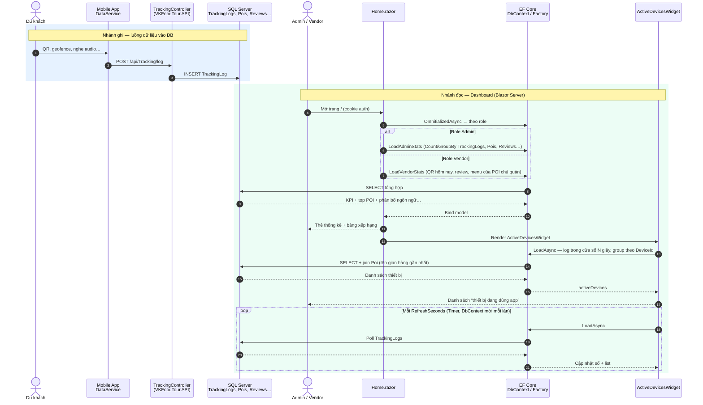
```mermaid
sequenceDiagram
    autonumber
    actor U as Du khách
    participant M as Mobile App<br/>DataService
    participant API as TrackingController<br/>(VKFoodTour.API)
    participant DB as SQL Server<br/>TrackingLogs, Pois, Reviews…

    rect rgb(230, 242, 255)
        Note over U,DB: Nhánh ghi — luồng dữ liệu vào DB
        U->>M: QR, geofence, nghe audio…
        M->>API: POST /api/Tracking/log
        API->>DB: INSERT TrackingLog
    end

    actor Op as Admin / Vendor
    participant H as Home.razor
    participant EF as EF Core<br/>DbContext / Factory
    participant W as ActiveDevicesWidget

    rect rgb(236, 253, 245)
        Note over Op,W: Nhánh đọc — Dashboard (Blazor Server)
        Op->>H: Mở trang / (cookie auth)
        H->>EF: OnInitializedAsync → theo role
        alt Role Admin
            H->>EF: LoadAdminStats (Count/GroupBy TrackingLogs, Pois, Reviews…)
        else Role Vendor
            H->>EF: LoadVendorStats (QR hôm nay, review, menu của POI chủ quán)
        end
        EF->>DB: SELECT tổng hợp
        DB-->>EF: KPI + top POI + phân bố ngôn ngữ…
        EF-->>H: Bind model
        H-->>Op: Thẻ thống kê + bảng xếp hạng

        H->>W: Render ActiveDevicesWidget
        W->>EF: LoadAsync — log trong cửa sổ N giây, group theo DeviceId
        EF->>DB: SELECT + join Poi (tên gian hàng gần nhất)
        DB-->>EF: Danh sách thiết bị
        EF-->>W: activeDevices
        W-->>Op: Danh sách “thiết bị đang dùng app”

        loop Mỗi RefreshSeconds (Timer, DbContext mới mỗi lần)
            W->>EF: LoadAsync
            EF->>DB: Poll TrackingLogs
            DB-->>EF: …
            EF-->>W: Cập nhật số + list
        end
    end
```

**Ghi chú:**

- **Heatmap** trên bản đồ tổng quan nằm ở `/admin/ban-do` (`BanDoPoi.razor`): cũng đọc `TrackingLogs` qua EF + đẩy JSON sang JS (`updateOverviewHeatmap`), không đi qua `GET /api/Tracking/heatmap` từ Blazor.
- Component **`OnlineUsersWidget`** cùng pattern (Timer + `IDbContextFactory`) nhưng **chưa được nhúng** vào `Home.razor`; trang chủ admin hiện dùng **`ActiveDevicesWidget`** (`WindowSeconds=45`, `RefreshSeconds=3`).

#### 4.5.1. SEQ-05a – Admin Dashboard: phương thức trong `Home.razor` & `ActiveDevicesWidget`

**Mô tả:** Chuỗi gọi **theo code thực tế** khi user role **Admin** mở `/`. File: `Admin/Components/Pages/Home.razor`, widget: `Admin/Components/Pages/Admin/ActiveDevicesWidget.razor`.

**A) `Home.razor` — `OnInitializedAsync` → `LoadAdminStats` (inject `ApplicationDbContext Db`)**

| Thứ tự | Phương thức / truy vấn |
|--------|------------------------|
| 1 | `AuthenticationStateProvider.GetAuthenticationStateAsync()` |
| 2 | `LoadAdminStats()` |
| 3 | `Db.Pois.CountAsync()` |
| 4 | `Db.Pois.CountAsync(p => p.IsActive)` |
| 5 | `Db.Narrations.CountAsync()` |
| 6 | `Db.Languages.CountAsync(l => l.IsActive)` |
| 7 | `Db.Users.CountAsync()` |
| 8 | `Db.Users.CountAsync(u => u.Role == "Vendor")` |
| 9 | `Db.TrackingLogs.CountAsync(t => t.EventType == "qr_scan" && t.CreatedAt >= today)` |
| 10 | `Db.TrackingLogs.CountAsync(t => t.CreatedAt >= today && t.EventType != "move")` |
| 11 | `listenLogs.AnyAsync()` rồi `listenLogs.AverageAsync(t => t.ListenedDurationSec!.Value)` (`listenLogs` = `TrackingLogs` lọc `listen_end`) |
| 12 | `Db.TrackingLogs` … `GroupBy`/`OrderByDescending`/`Take(5)` → `ToListAsync()` (top POI) |
| 13 | `Db.Pois.Where(...).ToDictionaryAsync(p => p.PoiId, p => p.Name)` |
| 14 | Vòng `foreach` gán `TopPoiItem.PoiName` |
| 15 | `Db.TrackingLogs` … `GroupBy` POI `listen_end` → `ToListAsync()` (top audio) |
| 16 | `foreach` gán `TopAudioItem.PoiName` (dùng `poiNames`) |
| 17 | `Db.TrackingLogs` group theo `LanguageCode` → `ToListAsync()` |
| 18 | `Db.Languages.ToDictionaryAsync(l => l.Code, l => l.Name)` |
| 19 | Build `languageStats` (LINQ trên bộ nhớ) |
| 20 | `Db.Reviews.CountAsync()` |
| 21 | `Db.Reviews.GroupBy(r => (int)r.Rating).ToDictionaryAsync(...)` → `ratingDistribution` |

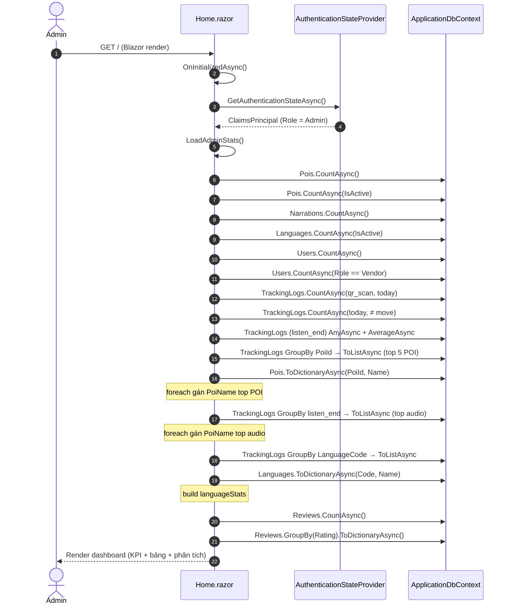
```mermaid
sequenceDiagram
    autonumber
    actor Ad as Admin
    participant H as Home.razor
    participant Auth as AuthenticationStateProvider
    participant Db as ApplicationDbContext

    Ad->>H: GET / (Blazor render)
    H->>H: OnInitializedAsync()
    H->>Auth: GetAuthenticationStateAsync()
    Auth-->>H: ClaimsPrincipal (Role = Admin)
    H->>H: LoadAdminStats()

    H->>Db: Pois.CountAsync()
    H->>Db: Pois.CountAsync(IsActive)
    H->>Db: Narrations.CountAsync()
    H->>Db: Languages.CountAsync(IsActive)
    H->>Db: Users.CountAsync()
    H->>Db: Users.CountAsync(Role == Vendor)
    H->>Db: TrackingLogs.CountAsync(qr_scan, today)
    H->>Db: TrackingLogs.CountAsync(today, ≠ move)
    H->>Db: TrackingLogs (listen_end) AnyAsync + AverageAsync
    H->>Db: TrackingLogs GroupBy PoiId → ToListAsync (top 5 POI)
    H->>Db: Pois.ToDictionaryAsync(PoiId, Name)
    Note over H: foreach gán PoiName top POI
    H->>Db: TrackingLogs GroupBy listen_end → ToListAsync (top audio)
    Note over H: foreach gán PoiName top audio
    H->>Db: TrackingLogs GroupBy LanguageCode → ToListAsync
    H->>Db: Languages.ToDictionaryAsync(Code, Name)
    Note over H: build languageStats
    H->>Db: Reviews.CountAsync()
    H->>Db: Reviews.GroupBy(Rating).ToDictionaryAsync()
    H-->>Ad: Render dashboard (KPI + bảng + phân tích)
```

**B) `ActiveDevicesWidget` — inject `IDbContextFactory<ApplicationDbContext> DbFactory`**

| Thứ tự | Phương thức |
|--------|-------------|
| 1 | `OnInitializedAsync()` |
| 2 | `Math.Clamp(WindowSeconds, 15, 300)` |
| 3 | `LoadAsync()` |
| 4 | `DbFactory.CreateDbContextAsync()` |
| 5 | `db.TrackingLogs.AsNoTracking()…GroupBy(DeviceId)…ToListAsync()` |
| 6 | `db.Pois.AsNoTracking()…ToDictionaryAsync(PoiId, Name)` (nếu có `poiIds`) |
| 7 | Gán `activeDevices` (LINQ trên bộ nhớ) |
| 8 | `new Timer(...)` — refresh mỗi `RefreshSeconds` (3s): gọi lại `LoadAsync()` + `InvokeAsync(StateHasChanged)` |
| 9 | `new Timer(...)` — mỗi 1s: cập nhật `secondsAgo` + `StateHasChanged` |
| 10 | `DisposeAsync()` — hủy hai timer |

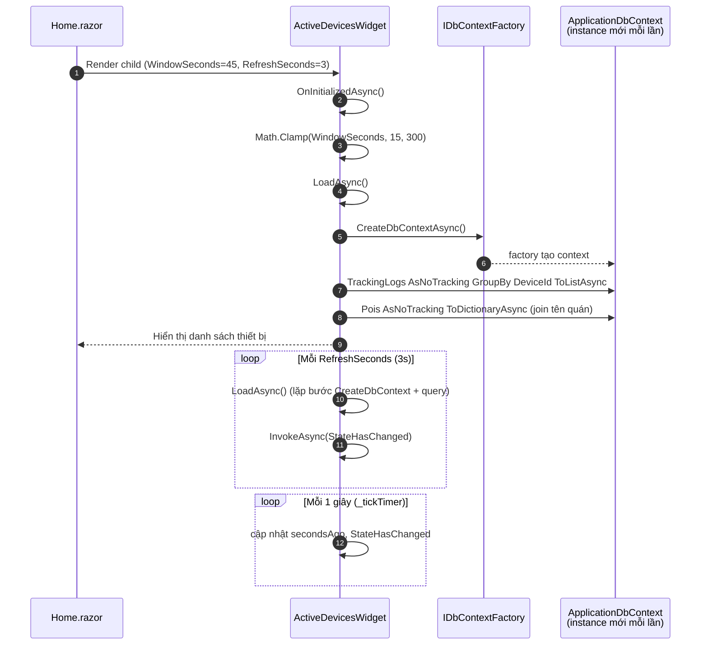
```mermaid
sequenceDiagram
    autonumber
    participant H as Home.razor
    participant W as ActiveDevicesWidget
    participant F as IDbContextFactory
    participant Db as ApplicationDbContext<br/>(instance mới mỗi lần)

    H->>W: Render child (WindowSeconds=45, RefreshSeconds=3)
    W->>W: OnInitializedAsync()
    W->>W: Math.Clamp(WindowSeconds, 15, 300)
    W->>W: LoadAsync()
    W->>F: CreateDbContextAsync()
    F-->>Db: factory tạo context
    W->>Db: TrackingLogs AsNoTracking GroupBy DeviceId ToListAsync
    W->>Db: Pois AsNoTracking ToDictionaryAsync (join tên quán)
    W-->>H: Hiển thị danh sách thiết bị

    loop Mỗi RefreshSeconds (3s)
        W->>W: LoadAsync() (lặp bước CreateDbContext + query)
        W->>W: InvokeAsync(StateHasChanged)
    end

    loop Mỗi 1 giây (_tickTimer)
        W->>W: cập nhật secondsAgo, StateHasChanged
    end
```

**Ghi chú thứ tự Blazor:** `Home.OnInitializedAsync` (gồm `LoadAdminStats`) chạy trước khi subtree render xong; `ActiveDevicesWidget` khởi tạo sau (lifecycle con), nên block **A** hoàn tất trước **B** trong cùng lần tải trang đầu.

---

### 4.6. SEQ-06 – Du khách đánh giá quán

**Mô tả:** Sau khi nghe audio và xem chi tiết quán, du khách có thể gửi rating + bình luận về quán.

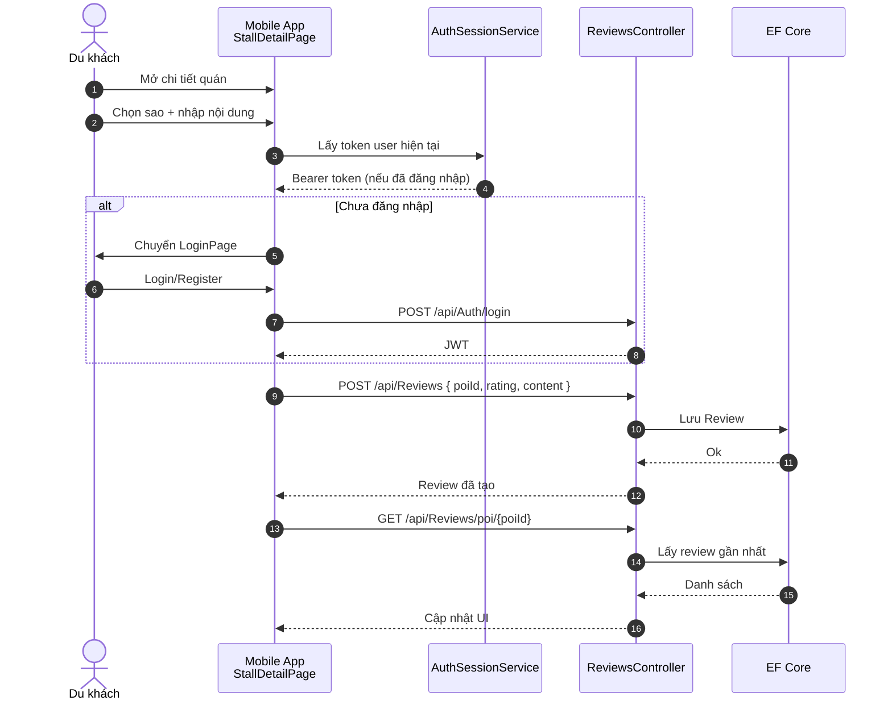
```mermaid
sequenceDiagram
    autonumber
    actor U as Du khách
    participant M as Mobile App<br/>StallDetailPage
    participant Auth as AuthSessionService
    participant API as ReviewsController
    participant DB as EF Core

    U->>M: Mở chi tiết quán
    U->>M: Chọn sao + nhập nội dung
    M->>Auth: Lấy token user hiện tại
    Auth-->>M: Bearer token (nếu đã đăng nhập)
    alt Chưa đăng nhập
        M->>U: Chuyển LoginPage
        U->>M: Login/Register
        M->>API: POST /api/Auth/login
        API-->>M: JWT
    end
    M->>API: POST /api/Reviews { poiId, rating, content }
    API->>DB: Lưu Review
    DB-->>API: Ok
    API-->>M: Review đã tạo
    M->>API: GET /api/Reviews/poi/{poiId}
    API->>DB: Lấy review gần nhất
    DB-->>API: Danh sách
    API-->>M: Cập nhật UI
```

---

### 4.7. SEQ-07 – Ưu tiên audio khi đứng giữa 2 geofence chồng lấn

**Mô tả:** Kịch bản du khách đang nghe audio của POI A thì bước vào vùng geofence của POI B (2 vùng chồng lấn, hoặc 2 quán cạnh nhau). `AudioQueueService` quyết định xử lý dựa trên **tiến độ track A đang phát** so với ngưỡng **60%**.

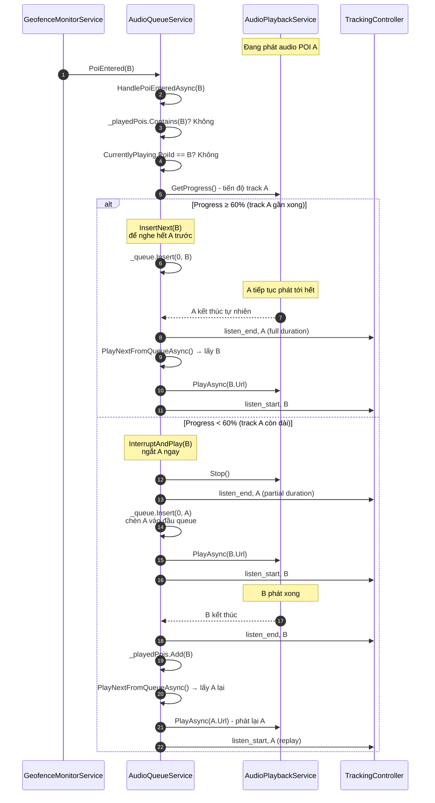
```mermaid
sequenceDiagram
    autonumber
    participant Geo as GeofenceMonitorService
    participant Q as AudioQueueService
    participant Play as AudioPlaybackService
    participant Track as TrackingController

    Note over Play: Đang phát audio POI A
    Geo->>Q: PoiEntered(B)
    Q->>Q: HandlePoiEnteredAsync(B)
    Q->>Q: _playedPois.Contains(B)? Không
    Q->>Q: CurrentlyPlaying.PoiId == B? Không
    Q->>Play: GetProgress() - tiến độ track A

    alt Progress ≥ 60% (track A gần xong)
        Note over Q: InsertNext(B)<br/>để nghe hết A trước
        Q->>Q: _queue.Insert(0, B)
        Note over Play: A tiếp tục phát tới hết
        Play-->>Q: A kết thúc tự nhiên
        Q->>Track: listen_end, A (full duration)
        Q->>Q: PlayNextFromQueueAsync() → lấy B
        Q->>Play: PlayAsync(B.Url)
        Q->>Track: listen_start, B
    else Progress < 60% (track A còn dài)
        Note over Q: InterruptAndPlay(B)<br/>ngắt A ngay
        Q->>Play: Stop()
        Q->>Track: listen_end, A (partial duration)
        Q->>Q: _queue.Insert(0, A)<br/>chèn A vào đầu queue
        Q->>Play: PlayAsync(B.Url)
        Q->>Track: listen_start, B

        Note over Play: B phát xong
        Play-->>Q: B kết thúc
        Q->>Track: listen_end, B
        Q->>Q: _playedPois.Add(B)
        Q->>Q: PlayNextFromQueueAsync() → lấy A lại
        Q->>Play: PlayAsync(A.Url) - phát lại A
        Q->>Track: listen_start, A (replay)
    end
```

**Giải thích ý nghĩa ngưỡng 60%:**
- Với ngưỡng **≥ 60%**: track đang phát đã gần xong → cho nghe trọn vẹn để giữ trải nghiệm liền mạch, POI mới xếp kế tiếp.
- Với ngưỡng **< 60%**: du khách vừa mới bước vào quán cũ và chưa nghe được bao nhiêu, giờ đã ở gần quán mới – ưu tiên thông tin về **vị trí hiện tại**, ngắt track cũ, phát track mới, và phát lại track cũ sau khi track mới kết thúc.
- Hằng số `InterruptThreshold = 0.60` được định nghĩa trong `AudioQueueService.cs` – có thể tune để thay đổi hành vi.

**Các nhánh an toàn khác (code thực tế):**
- Nếu POI B đã có trong `_playedPois` → **bỏ qua** (không phát lại).
- Nếu POI B chính là track đang phát (`CurrentlyPlaying.PoiId == B`) → **bỏ qua** (tránh double-trigger do GPS jitter).
- Nếu `CurrentlyPlaying != null` nhưng `IsPlaying == false` (bootstrap/loading) → **InsertNext** để tránh race condition.

---

### 4.8. SEQ-08 – Pattern CRUD có duyệt (generic)

**Mô tả:** Sơ đồ **chung** cho tất cả chức năng CRUD có luồng duyệt trong hệ thống – áp dụng cho: quản lý POI, thực đơn, người dùng, ngôn ngữ, QR code, review, feedback, audio… Khi xem một chức năng CRUD trong bảng liệt kê (mục 3), tham chiếu sơ đồ này thay vì vẽ lại từng cái.

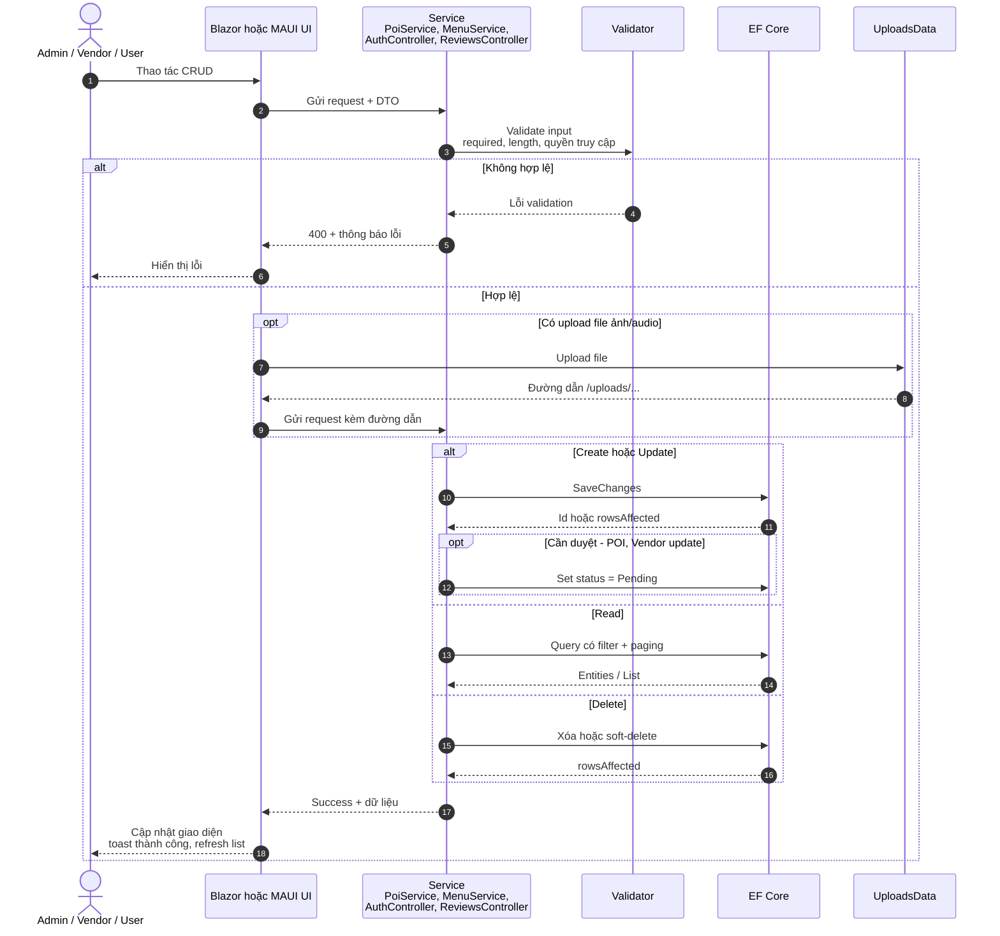
```mermaid
sequenceDiagram
    autonumber
    actor U as Admin / Vendor / User
    participant UI as Blazor hoặc MAUI UI
    participant SVC as Service<br/>PoiService, MenuService,<br/>AuthController, ReviewsController
    participant V as Validator
    participant DB as EF Core
    participant FS as UploadsData

    U->>UI: Thao tác CRUD
    UI->>SVC: Gửi request + DTO
    SVC->>V: Validate input<br/>required, length, quyền truy cập
    alt Không hợp lệ
        V-->>SVC: Lỗi validation
        SVC-->>UI: 400 + thông báo lỗi
        UI-->>U: Hiển thị lỗi
    else Hợp lệ
        opt Có upload file ảnh/audio
            UI->>FS: Upload file
            FS-->>UI: Đường dẫn /uploads/...
            UI->>SVC: Gửi request kèm đường dẫn
        end

        alt Create hoặc Update
            SVC->>DB: SaveChanges
            DB-->>SVC: Id hoặc rowsAffected
            opt Cần duyệt - POI, Vendor update
                SVC->>DB: Set status = Pending
            end
        else Read
            SVC->>DB: Query có filter + paging
            DB-->>SVC: Entities / List
        else Delete
            SVC->>DB: Xóa hoặc soft-delete
            DB-->>SVC: rowsAffected
        end

        SVC-->>UI: Success + dữ liệu
        UI-->>U: Cập nhật giao diện<br/>toast thành công, refresh list
    end
```

**Áp dụng cho các chức năng:**

| Chức năng | Actor | Service/Controller | File? |
|---|---|---|---|
| Quản lý POI | Admin / Vendor | `PoiService` | Có ảnh |
| Quản lý thực đơn | Vendor | `MenuService` | Có ảnh |
| Quản lý ngôn ngữ | Admin | (Blazor page) | Không |
| Quản lý QR | Admin | (`QrController` resolve) | Không |
| Quản lý người dùng | Admin | `NguoiDung.razor` | Không |
| Gửi review | User | `ReviewsController` | Không |
| Gửi feedback app | User | `FeedbackController` | Không |
| Upload audio | Admin | `EdgeTtsService` + file write | Có file |

---

### 4.9. SEQ-09 – Hiển thị Heatmap tracking trên Web Admin

**Mô tả:** Luồng tải và hiển thị heatmap thực tế trên trang `BanDoPoi.razor`. Admin bật switch heatmap, chọn mốc thời gian, UI gọi API `Tracking/heatmap`, sau đó đẩy dữ liệu sang JS interop để cập nhật lớp heatmap trên bản đồ.

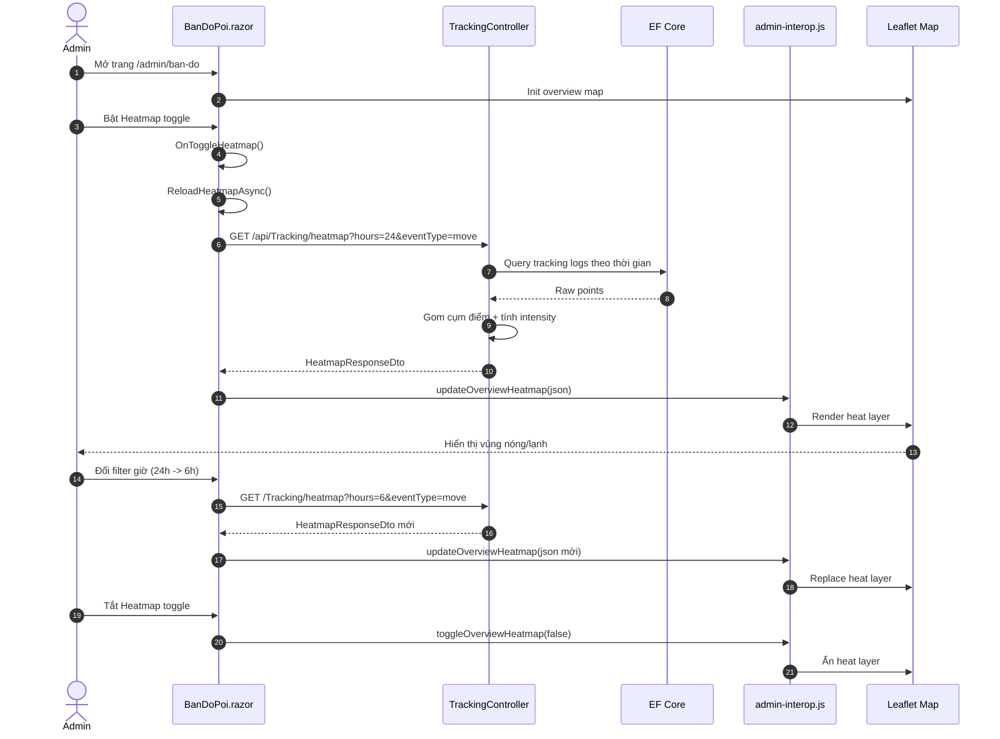
```mermaid
sequenceDiagram
    autonumber
    actor Ad as Admin
    participant UI as BanDoPoi.razor
    participant API as TrackingController
    participant DB as EF Core
    participant JS as admin-interop.js
    participant Map as Leaflet Map

    Ad->>UI: Mở trang /admin/ban-do
    UI->>Map: Init overview map
    Ad->>UI: Bật Heatmap toggle
    UI->>UI: OnToggleHeatmap()
    UI->>UI: ReloadHeatmapAsync()
    UI->>API: GET /api/Tracking/heatmap?hours=24&eventType=move
    API->>DB: Query tracking logs theo thời gian
    DB-->>API: Raw points
    API->>API: Gom cụm điểm + tính intensity
    API-->>UI: HeatmapResponseDto
    UI->>JS: updateOverviewHeatmap(json)
    JS->>Map: Render heat layer
    Map-->>Ad: Hiển thị vùng nóng/lạnh

    Ad->>UI: Đổi filter giờ (24h -> 6h)
    UI->>API: GET /Tracking/heatmap?hours=6&eventType=move
    API-->>UI: HeatmapResponseDto mới
    UI->>JS: updateOverviewHeatmap(json mới)
    JS->>Map: Replace heat layer

    Ad->>UI: Tắt Heatmap toggle
    UI->>JS: toggleOverviewHeatmap(false)
    JS->>Map: Ẩn heat layer
```

**Điểm kỹ thuật chính (đúng code hiện tại):**
- API endpoint: `GET /api/Tracking/heatmap` trong `TrackingController`.
- UI xử lý ở `BanDoPoi.razor` với các hàm `OnToggleHeatmap()` và `ReloadHeatmapAsync()`.
- JS interop: `updateOverviewHeatmap()` và `toggleOverviewHeatmap()` trong `admin-interop.js`.

---

### 4.10. SEQ-10 – Quản lý ngôn ngữ và ánh xạ TTS voice

**Mô tả:** Luồng quản lý ngôn ngữ trên trang `QuanLyNgonNgu.razor`: Admin thêm ngôn ngữ mới, cấu hình mã ngôn ngữ + voice, bật/tắt trạng thái hoạt động. Cấu hình này được dùng lại khi dịch nội dung và sinh audio thuyết minh.

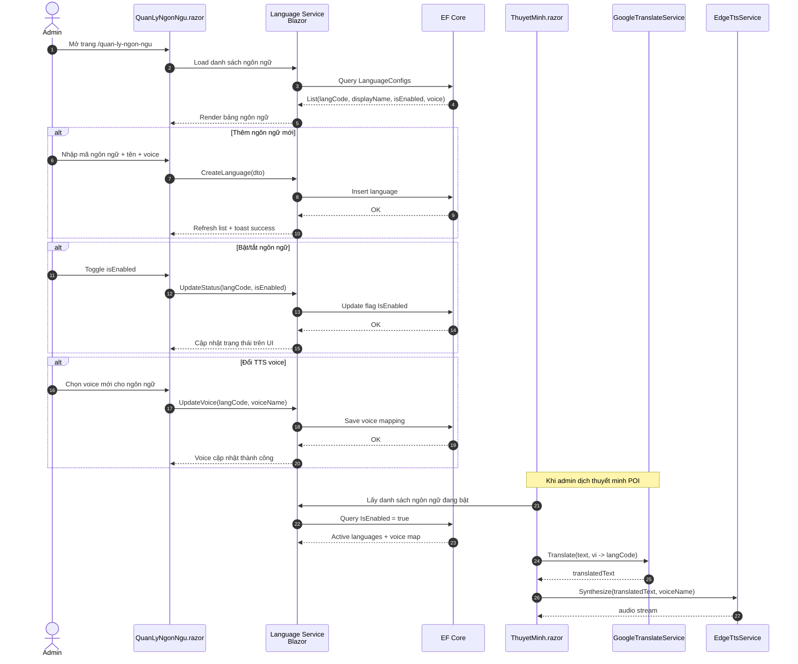
```mermaid
sequenceDiagram
    autonumber
    actor Ad as Admin
    participant UI as QuanLyNgonNgu.razor
    participant SVC as Language Service<br/>Blazor
    participant DB as EF Core
    participant TM as ThuyetMinh.razor
    participant GT as GoogleTranslateService
    participant TTS as EdgeTtsService

    Ad->>UI: Mở trang /quan-ly-ngon-ngu
    UI->>SVC: Load danh sách ngôn ngữ
    SVC->>DB: Query LanguageConfigs
    DB-->>SVC: List(langCode, displayName, isEnabled, voice)
    SVC-->>UI: Render bảng ngôn ngữ

    alt Thêm ngôn ngữ mới
        Ad->>UI: Nhập mã ngôn ngữ + tên + voice
        UI->>SVC: CreateLanguage(dto)
        SVC->>DB: Insert language
        DB-->>SVC: OK
        SVC-->>UI: Refresh list + toast success
    end

    alt Bật/tắt ngôn ngữ
        Ad->>UI: Toggle isEnabled
        UI->>SVC: UpdateStatus(langCode, isEnabled)
        SVC->>DB: Update flag IsEnabled
        DB-->>SVC: OK
        SVC-->>UI: Cập nhật trạng thái trên UI
    end

    alt Đổi TTS voice
        Ad->>UI: Chọn voice mới cho ngôn ngữ
        UI->>SVC: UpdateVoice(langCode, voiceName)
        SVC->>DB: Save voice mapping
        DB-->>SVC: OK
        SVC-->>UI: Voice cập nhật thành công
    end

    Note over TM,GT: Khi admin dịch thuyết minh POI
    TM->>SVC: Lấy danh sách ngôn ngữ đang bật
    SVC->>DB: Query IsEnabled = true
    DB-->>SVC: Active languages + voice map
    TM->>GT: Translate(text, vi -> langCode)
    GT-->>TM: translatedText
    TM->>TTS: Synthesize(translatedText, voiceName)
    TTS-->>TM: audio stream
```

**Điểm kỹ thuật chính:**
- Trang quản lý: `QuanLyNgonNgu.razor`.
- Ngôn ngữ bật (`isEnabled=true`) là nguồn dữ liệu cho luồng dịch/sinh audio ở `ThuyetMinh.razor`.
- TTS sử dụng `voice` đã ánh xạ theo từng ngôn ngữ để đảm bảo phát âm đúng.

---

## 5. Sơ đồ Activity & State

### 5.1. ACT-01 – Hành trình du khách end-to-end trên Mobile App

**Mô tả:** Toàn bộ luồng của Mobile App từ khi mở app (WelcomePage) đến khi kết thúc tour.

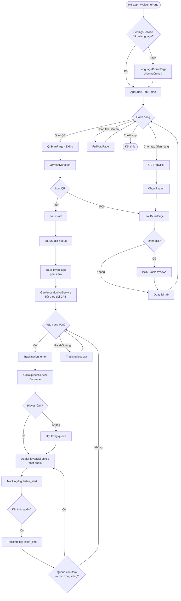
```mermaid
flowchart TD
    Start([Mở app - WelcomePage]) --> Lang{SettingsService<br/>đã có language?}
    Lang -- Chưa --> Pick[LanguagePickerPage<br/>chọn ngôn ngữ]
    Lang -- Rồi --> Home[AppShell: Tab Home]
    Pick --> Home
    Home --> Action{Hành động}
    Action -- Quét QR --> QR[QrScanPage - ZXing]
    QR --> Res[Qr/resolve/token]
    Res --> Kind{Loại QR}
    Kind -- Tour --> TStart[Tour/start]
    TStart --> TQ[Tour/audio-queue]
    TQ --> TPlay[TourPlayerPage<br/>phát intro]
    TPlay --> GeoOn[GeofenceMonitorService<br/>bật theo dõi GPS]
    Kind -- POI --> Detail[StallDetailPage]
    Action -- Chọn tab Gian hàng --> List[GET /api/Poi]
    List --> Select[Chọn 1 quán]
    Select --> Detail
    Action -- Chọn tab Bản đồ --> Map[FullMapPage]

    GeoOn --> InZone{Vào vùng POI?}
    InZone -- Có --> LogEnter[Tracking/log: enter]
    LogEnter --> Enq[AudioQueueService<br/>Enqueue]
    Enq --> Idle{Player rảnh?}
    Idle -- Có --> PPlay[AudioPlaybackService<br/>phát audio]
    Idle -- Không --> Wait[Đợi trong queue]
    Wait --> PPlay
    PPlay --> LogS[Tracking/log: listen_start]
    LogS --> EndChk{Kết thúc audio?}
    EndChk -- Có --> LogE[Tracking/log: listen_end]
    LogE --> Next{Queue còn item<br/>và còn trong vùng?}
    Next -- Có --> PPlay
    Next -- Không --> InZone
    InZone -- Ra khỏi vùng --> LogExit[Tracking/log: exit]
    LogExit --> InZone

    Detail --> Rev{Đánh giá?}
    Rev -- Có --> Review[POST /api/Reviews]
    Rev -- Không --> Back[Quay lại tab]
    Review --> Back
    Back --> Action
    Action -- Thoát app --> Stop([Kết thúc])
    Map --> Action
```

---

### 5.2. ACT-02 – Duyệt POI của Admin trong `PoiList.razor`

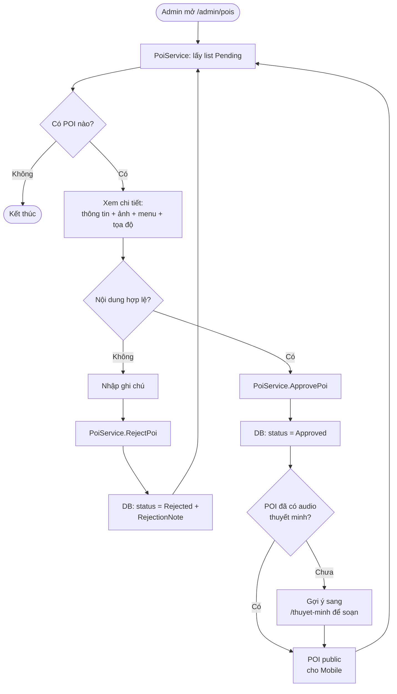
```mermaid
flowchart TD
    A([Admin mở /admin/pois]) --> B[PoiService: lấy list Pending]
    B --> C{Có POI nào?}
    C -- Không --> Z([Kết thúc])
    C -- Có --> D[Xem chi tiết:<br/>thông tin + ảnh + menu + tọa độ]
    D --> E{Nội dung hợp lệ?}
    E -- Không --> F[Nhập ghi chú]
    F --> G[PoiService.RejectPoi]
    G --> H[DB: status = Rejected +<br/>RejectionNote]
    H --> B
    E -- Có --> I[PoiService.ApprovePoi]
    I --> J[DB: status = Approved]
    J --> K{POI đã có audio<br/>thuyết minh?}
    K -- Chưa --> L[Gợi ý sang<br/>/thuyet-minh để soạn]
    K -- Có --> M[POI public<br/>cho Mobile]
    L --> M
    M --> B
```

---

### 5.3. ACT-03 – Vendor cập nhật gian hàng

**Mô tả:** Vendor dùng chung Blazor app, chỉ thấy các trang `/vendor/*` theo role.

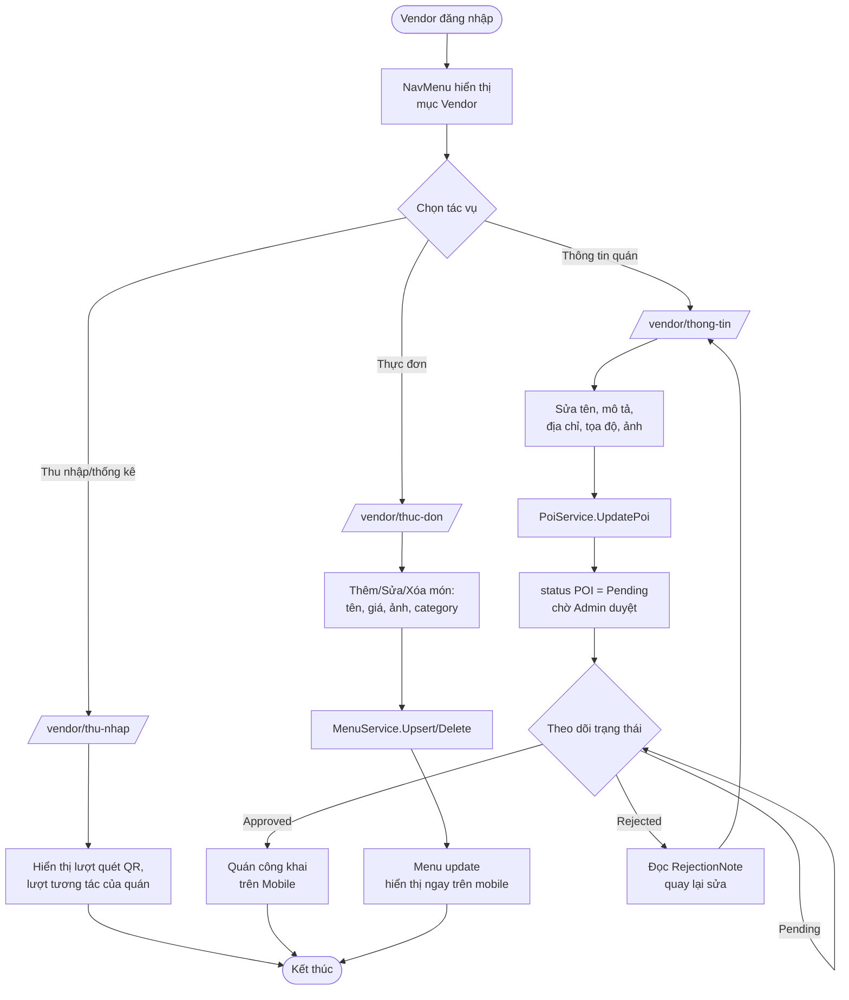
```mermaid
flowchart TD
    A([Vendor đăng nhập]) --> B[NavMenu hiển thị<br/>mục Vendor]
    B --> E{Chọn tác vụ}
    E -- Thông tin quán --> G[/vendor/thong-tin/]
    G --> G1[Sửa tên, mô tả,<br/>địa chỉ, tọa độ, ảnh]
    G1 --> J[PoiService.UpdatePoi]
    E -- Thực đơn --> I[/vendor/thuc-don/]
    I --> I1[Thêm/Sửa/Xóa món:<br/>tên, giá, ảnh, category]
    I1 --> JM[MenuService.Upsert/Delete]
    E -- Thu nhập/thống kê --> R[/vendor/thu-nhap/]
    R --> R1[Hiển thị lượt quét QR,<br/>lượt tương tác của quán]
    R1 --> Z([Kết thúc])
    J --> K[status POI = Pending<br/>chờ Admin duyệt]
    JM --> K2[Menu update<br/>hiển thị ngay trên mobile]
    K --> L{Theo dõi trạng thái}
    L -- Approved --> N[Quán công khai<br/>trên Mobile]
    L -- Rejected --> O[Đọc RejectionNote<br/>quay lại sửa]
    O --> G
    L -- Pending --> L
    N --> Z
    K2 --> Z
```

---

### 5.4. ACT-04 – Dịch & sinh audio thuyết minh trong `ThuyetMinh.razor`

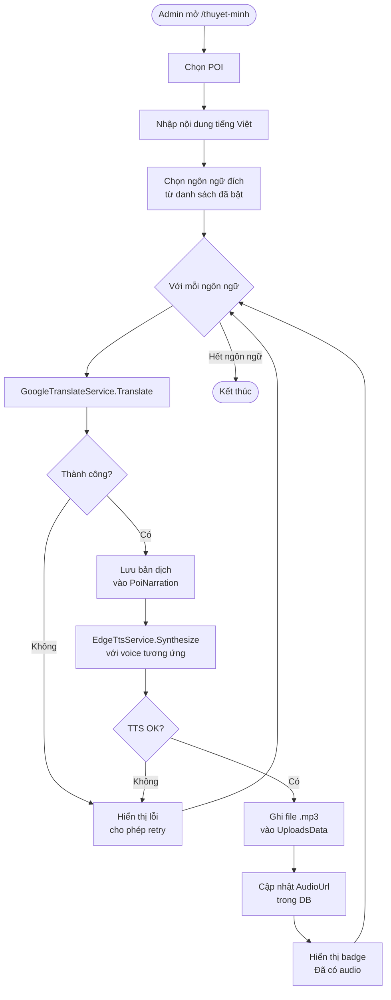
```mermaid
flowchart TD
    S([Admin mở /thuyet-minh]) --> P[Chọn POI]
    P --> P1[Nhập nội dung tiếng Việt]
    P1 --> Q[Chọn ngôn ngữ đích<br/>từ danh sách đã bật]
    Q --> R{Với mỗi ngôn ngữ}
    R --> U[GoogleTranslateService.Translate]
    U --> V{Thành công?}
    V -- Không --> W[Hiển thị lỗi<br/>cho phép retry]
    W --> R
    V -- Có --> Y[Lưu bản dịch<br/>vào PoiNarration]
    Y --> AA[EdgeTtsService.Synthesize<br/>với voice tương ứng]
    AA --> BB{TTS OK?}
    BB -- Không --> W
    BB -- Có --> CC[Ghi file .mp3<br/>vào UploadsData]
    CC --> DD[Cập nhật AudioUrl<br/>trong DB]
    DD --> EE[Hiển thị badge<br/>Đã có audio]
    EE --> R
    R -- Hết ngôn ngữ --> Z([Kết thúc])
```

---

### 5.5. ACT-05 – Logic Audio Queue với ngưỡng ưu tiên 60%

**Mô tả:** Logic thật của `HandlePoiEnteredAsync` trong `AudioQueueService.cs` khi nhận sự kiện `PoiEntered` từ `GeofenceMonitorService`.

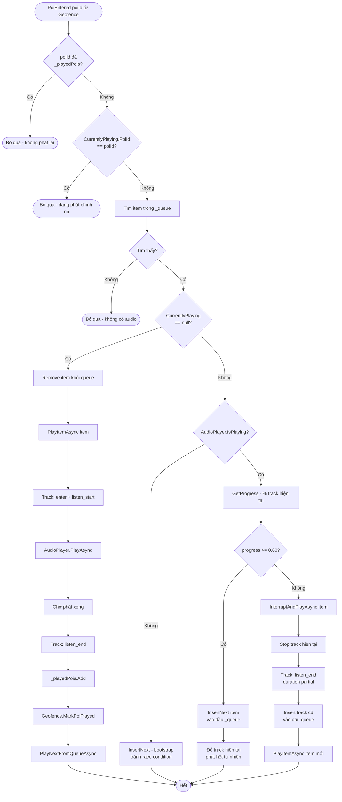
```mermaid
flowchart TD
    A([PoiEntered poiId từ Geofence]) --> B{poiId đã<br/>_playedPois?}
    B -- Có --> Z1([Bỏ qua - không phát lại])
    B -- Không --> C{CurrentlyPlaying.PoiId<br/>== poiId?}
    C -- Có --> Z2([Bỏ qua - đang phát chính nó])
    C -- Không --> D[Tìm item trong _queue]
    D --> E{Tìm thấy?}
    E -- Không --> Z3([Bỏ qua - không có audio])
    E -- Có --> F{CurrentlyPlaying<br/>== null?}
    F -- Có --> G[Remove item khỏi queue]
    G --> H[PlayItemAsync item]
    H --> H1[Track: enter + listen_start]
    H1 --> H2[AudioPlayer.PlayAsync]
    H2 --> H3[Chờ phát xong]
    H3 --> H4[Track: listen_end]
    H4 --> H5[_playedPois.Add]
    H5 --> H6[Geofence.MarkPoiPlayed]
    H6 --> H7[PlayNextFromQueueAsync]
    H7 --> End([Hết])

    F -- Không --> I{AudioPlayer.IsPlaying?}
    I -- Không --> J[InsertNext - bootstrap<br/>tránh race condition]
    J --> End
    I -- Có --> K[GetProgress - % track hiện tại]
    K --> L{progress >= 0.60?}
    L -- Có --> M[InsertNext item<br/>vào đầu _queue]
    M --> N[Để track hiện tại<br/>phát hết tự nhiên]
    N --> End
    L -- Không --> O[InterruptAndPlayAsync item]
    O --> O1[Stop track hiện tại]
    O1 --> O2[Track: listen_end<br/>duration partial]
    O2 --> O3[Insert track cũ<br/>vào đầu queue]
    O3 --> O4[PlayItemAsync item mới]
    O4 --> End
```

**Các hằng số tham chiếu trong code:**
- `GeofenceMonitorService.DwellThresholdSec = 8` – phải ở trong zone 8 giây mới trigger.
- `GeofenceMonitorService.ExitDebounceMs = 10_000` – 10 giây ngoài zone mới confirm exit.
- `GeofenceMonitorService.GpsBufferMeters = 10` – nới bán kính thêm 10m để bù GPS drift.
- `GeofenceMonitorService.PollIntervalMs = 3_000` – polling 3 giây.
- `AudioQueueService.InterruptThreshold = 0.60` – ngưỡng quyết định InsertNext vs Interrupt.

---

### 5.6. STATE-01 – Vòng đời (lifecycle) của POI

**Mô tả:** Sơ đồ state diagram thể hiện các trạng thái và chuyển đổi của một POI từ lúc Vendor tạo đến khi xuất hiện trên Mobile App.

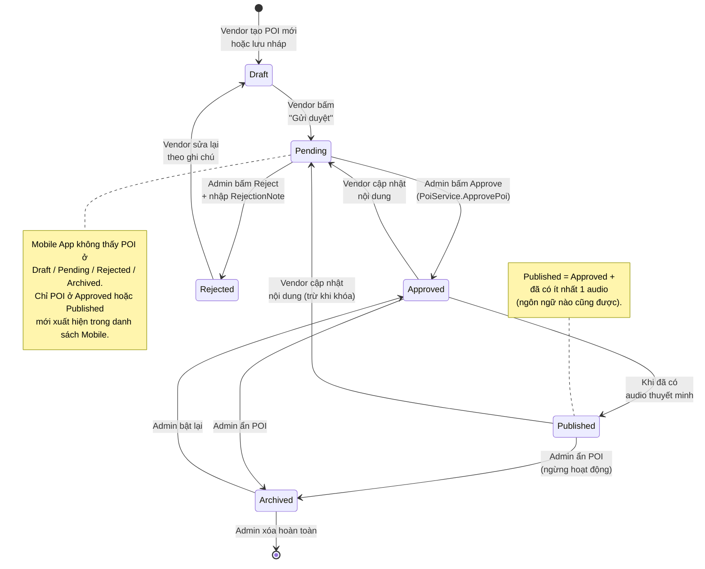
```mermaid
stateDiagram-v2
    [*] --> Draft: Vendor tạo POI mới<br/>hoặc lưu nháp

    Draft --> Pending: Vendor bấm<br/>"Gửi duyệt"
    Pending --> Approved: Admin bấm Approve<br/>(PoiService.ApprovePoi)
    Pending --> Rejected: Admin bấm Reject<br/>+ nhập RejectionNote
    Rejected --> Draft: Vendor sửa lại<br/>theo ghi chú

    Approved --> Published: Khi đã có<br/>audio thuyết minh

    Published --> Pending: Vendor cập nhật<br/>nội dung (trừ khi khóa)
    Approved --> Pending: Vendor cập nhật<br/>nội dung

    Published --> Archived: Admin ẩn POI<br/>(ngừng hoạt động)
    Approved --> Archived: Admin ẩn POI
    Archived --> Approved: Admin bật lại

    Archived --> [*]: Admin xóa hoàn toàn

    note right of Pending
        Mobile App không thấy POI ở<br/>Draft / Pending / Rejected / Archived.
        Chỉ POI ở Approved hoặc Published<br/>mới xuất hiện trong danh sách Mobile.
    end note

    note left of Published
        Published = Approved +<br/>đã có ít nhất 1 audio<br/>(ngôn ngữ nào cũng được).
    end note
```

**Ràng buộc chuyển trạng thái:**
- Mọi thay đổi nội dung quan trọng của Vendor đều **reset về `Pending`** để Admin xem lại.
- POI chỉ **hiển thị công khai trên Mobile** khi ở trạng thái `Approved` hoặc `Published`.
- Chuyển sang `Archived` là **soft-delete** – vẫn giữ log tracking lịch sử.

---

## 6. Yêu cầu phi chức năng

| Hạng mục | Yêu cầu |
|---|---|
| Hiệu năng | API < 500ms cho các request chính; audio trigger theo geofence trong vài giây. Có sẵn `load_test.js` và `stress_test.js` để kiểm thử tải. |
| Bảo mật | Cookie auth + Google OAuth cho Admin/Vendor; JWT cho Mobile (`AuthController`); mật khẩu hash; static files phục vụ qua `/uploads`. |
| Khả dụng | App không crash khi API lỗi – `DataService` có `FallbackDemo()` để hiển thị dữ liệu tối thiểu. |
| Đa ngôn ngữ | Thêm ngôn ngữ trong `QuanLyNgonNgu.razor` → sinh audio là có thể sử dụng, không cần build lại app. |
| Tracking | Mọi hành vi chính (`qr_scan`, `enter`, `exit`, `listen_start`, `listen_end`) đều được ghi qua `Tracking/log` cho heatmap và thống kê. |

---

## 7. Phụ lục

### 7.1. Danh sách event tracking (Mobile → `Tracking/log`)
- `qr_scan` – quét QR đầu phố hoặc QR quán.
- `enter` / `exit` – vào / rời vùng geofence POI.
- `listen_start` / `listen_end` – bắt đầu / kết thúc phát audio.
- `move` – cập nhật vị trí di chuyển (phục vụ heatmap).

### 7.2. Danh sách API chính

| Controller | Endpoint | Mục đích |
|---|---|---|
| `AuthController` | `POST /api/Auth/login`, `/register` | Đăng nhập/đăng ký du khách (role User) |
| `PoiController` | `GET /api/Poi`, `GET /api/Poi/{id}`, `GET /api/Poi/{id}/detail` | Lấy danh sách / chi tiết POI đã localize |
| `LanguagesController` | `GET /api/Languages` | Danh sách ngôn ngữ có audio thuyết minh |
| `QrController` | `GET /api/Qr/resolve/{token}` | Resolve QR sang tour hoặc POI |
| `TourController` | `POST /api/Tour/start`, `GET /api/Tour/audio-queue`, `POST /api/Tour/track-listen` | Bắt đầu tour, tải audio queue, log nghe audio |
| `TrackingController` | `POST /api/Tracking/log`, `GET /api/Tracking/online-count`, `GET /api/Tracking/heatmap` | Ghi log + số thiết bị online + dữ liệu heatmap |
| `ReviewsController` | `GET /api/Reviews/recent`, `GET /api/Reviews/poi/{poiId}`, `POST /api/Reviews` | Danh sách review + gửi review |
| `FeedbackController` | `POST /api/Feedback/app` | Gửi feedback app từ du khách |

### 7.3. Thành phần dự án
- `Admin/` – **Web Admin + Vendor** (ASP.NET Core **Blazor Server**), phân quyền theo role `Admin` / `Vendor`.
- `VKFoodTour.API/` – ASP.NET Core Web API (JWT), phục vụ static files `UploadsData/` qua `/uploads`.
- `VKFoodTour.Application/` – project dự phòng cho layer Application (hiện tại gần như trống, logic đặt trực tiếp trong API controller và `Admin/Services`).
- `VKFoodTour.Infrastructure/` – `ApplicationDbContext`, Entities, Migrations (EF Core).
- `VKFoodTour.Shared/` – DTO dùng chung: `PoiDto`, `PoiDetailDto`, `TourDtos`, `AuthDtos`, `ReviewDtos`, `TrackingDtos`, `QrResolveDto`, `LanguageListItemDto`, `AppFeedbackDtos`.
- `VKFoodTour.Mobile/` – App **.NET MAUI** (ZXing QR, Maui Maps, Plugin.Maui.Audio) với `DataService`, `AuthSessionService`, `SettingsService`, `LocalizationService`, `FavoriteService`, `HttpImageService`, `AudioPlaybackService`, `AudioQueueService`, `GeofenceMonitorService`.
- `VKFoodTour.Mobile.Core/` – Core library dùng chung (chứa `PoiApiService` như bản thay thế tương lai).
- `Database/VKFoodTour.sql` – script DDL + seed.
- `UploadsData/` – chứa file ảnh và audio sinh ra từ Edge TTS.

---

_Tài liệu này là bản đặc tả yêu cầu sản phẩm (PRD) cho hệ thống VKFoodTour, phục vụ mục đích phát triển, nghiệm thu và báo cáo đồ án._
