# PRD – Hệ thống VinhKhanhStreet (VKFoodTour)

> **Product Requirements Document**
> Dự án: Nền tảng Food Tour thông minh với audio guide đa ngôn ngữ cho phố ẩm thực
> Phiên bản: 1.1
> Ngày cập nhật: 27/04/2026

> **Phiên bản có ảnh sơ đồ đã render:** xem `docs/diagrams/PRD.Rendered.md` (đã thay tất cả khối Mermaid bằng PNG/SVG).
> **Render lại khi sửa file này:** chạy `pwsh -File docs/render-prd.ps1` từ thư mục gốc.

---

## 1. Tổng quan đồ án

### 1.1. Bối cảnh
Phố ẩm thực tại Việt Nam ngày càng phát triển và thu hút lượng lớn du khách trong và ngoài nước. Tuy nhiên, du khách thường gặp các vấn đề:
- Không hiểu được câu chuyện, văn hóa, lịch sử của từng quán.
- Rào cản ngôn ngữ khi đọc menu, biển hiệu, hỏi thông tin.
- Khó lựa chọn quán phù hợp do thiếu thông tin thống nhất.
- Trải nghiệm rời rạc, không có "sợi dây" dẫn dắt xuyên suốt tour.

Các giải pháp hiện có như Google Maps, TripAdvisor chỉ cung cấp thông tin tĩnh, không có trải nghiệm audio theo vị trí (location-based audio guide) và không hỗ trợ đa ngôn ngữ tự động cho từng quán nhỏ lẻ.

### 1.2. Mục tiêu sản phẩm
**VinhKhanhStreet (VKFoodTour)** là hệ thống trải nghiệm ẩm thực thông minh, bao gồm:
- **Web Admin**: nơi quản trị viên vận hành toàn bộ phố ẩm thực (POI, ngôn ngữ, audio, QR, thống kê).
- **Web Vendor**: nơi chủ quán tự quản lý gian hàng, thực đơn, media.
- **Mobile App**: ứng dụng dành cho du khách, quét QR đầu phố để bắt đầu tour audio đa ngôn ngữ, tự động thuyết minh theo vị trí GPS.

Mục tiêu cốt lõi:
1. Tạo trải nghiệm **audio tour tự động** theo geofence cho du khách.
2. Hỗ trợ **đa ngôn ngữ (i18n)** với dịch + TTS (Text-to-Speech) hàng loạt.
3. Hệ thống **QR-first**: một QR đầu phố khởi tạo toàn bộ tour, từng QR quán để xem chi tiết nhanh.
4. Cung cấp **dashboard thống kê realtime** phục vụ quản lý và quyết định kinh doanh.

### 1.3. Phạm vi & đối tượng sử dụng

| Đối tượng | Nền tảng | Vai trò chính |
|---|---|---|
| Admin | Web Admin (Blazor Server) | Quản trị toàn hệ thống, duyệt POI, cấu hình ngôn ngữ, tạo audio, quản lý QR, dịch nội dung |
| Vendor (chủ quán) | Web Vendor (cùng app Blazor, role `Vendor`) | Cập nhật thông tin quán, quản lý thực đơn, xem thống kê |
| Du khách (End-user) | Mobile App (.NET MAUI) | Quét QR, chọn ngôn ngữ, nghe audio theo vị trí, đánh giá |

### 1.4. Kiến trúc tổng thể

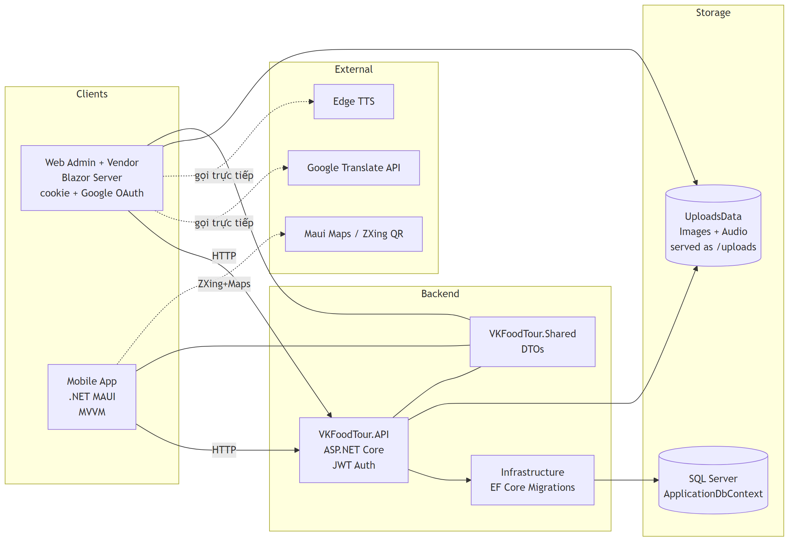

> **Ghi chú kiến trúc thực tế**
> - Nghiệp vụ được đặt trực tiếp trong Controller của API và trong `Admin/Services/` (không dùng CQRS/MediatR).
> - Google Translate và Edge TTS được gọi từ Web Admin (khi Admin soạn nội dung), không phải từ API runtime.
> - Không có SignalR hub nghiệp vụ – dashboard realtime dựa trên polling tracking log.

---

## 2. Use-case tổng quan

**Mô tả:** Sơ đồ use-case gom toàn bộ chức năng của hệ thống theo **3 actor** chính: Admin, Vendor, Du khách. Đây là cái nhìn tổng quan về phạm vi đồ án trước khi đi vào chi tiết từng module.

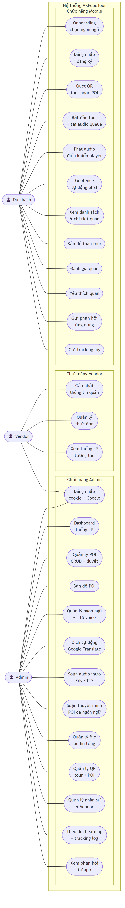

**Ghi chú:**
- Admin và Vendor **dùng chung hệ thống đăng nhập** (UA1) – phân quyền theo role.
- Chức năng "Quản lý POI" (UA3) **include** use-case "Duyệt POI" (Pending → Approved/Rejected) – chi tiết trạng thái xem ở sơ đồ State Lifecycle (STATE-01).
- Các use-case **dạng CRUD** (UA3, UA8, UA11, UV1, UV2) đều tuân theo pattern chung – xem sơ đồ SEQ-08 (CRUD generic).

---

## 3. Chức năng nổi bật

> Mỗi mục dưới đây liệt kê **route**, **file Razor / Service**, và **danh sách phương thức** thực sự được gọi khi vận hành tab. Phục vụ tra cứu nhanh khi maintain.

### 3.1. Web Admin (role `Admin`)

#### A1 — Dashboard tổng quan `/` (`Pages/Home.razor`)
| Khu vực | Mô tả | Phương thức / nguồn dữ liệu |
|---|---|---|
| Realtime thiết bị | Đếm device đang dùng app trong cửa sổ vài chục giây | `ActiveDevicesWidget.LoadAsync()` → đọc `Db.TrackingLogs` (poll mỗi 3s) |
| Thống kê hệ thống | Tổng POI / POI đang hoạt động / tổng thuyết minh / số ngôn ngữ active / tổng user / số vendor / lượt QR hôm nay | `Home.LoadAdminStats()` |
| Hành vi người dùng | Tổng tương tác hôm nay (loại trừ heartbeat `move`), thời gian nghe TB, tổng đánh giá | `Home.LoadAdminStats()` |
| Top gian hàng | Top 5 POI có nhiều lượt `enter` + `qr_scan` | Group `TrackingLogs` theo `PoiId` |
| Top thuyết minh | Top 5 POI có tổng phút nghe lớn nhất (`listen_end`) | Sum `ListenedDurationSec` |
| Ngôn ngữ sử dụng | Đếm **số thiết bị duy nhất** theo ngôn ngữ MỚI NHẤT của họ trong 30 ngày, chuẩn hoá bỏ `anon:` / region | `Home.LoadAdminStats()` + `NormalizeLangCode()` |
| Phân bổ đánh giá | Histogram 1-5 sao | `Db.Reviews.GroupBy(Rating)` |

#### A2 — Quản lý gian hàng `/admin/pois` (`Pages/PoiList.razor` + `Services/PoiService.cs`)
| Tác vụ | Phương thức |
|---|---|
| Tìm kiếm theo tên + lọc trạng thái + lọc phê duyệt | `FilteredPois` (LINQ in-memory) |
| Tải danh sách POI và Vendor | `PoiService.GetAllAsync()`, `AuthService.GetAllUsersAsync()` |
| Mở modal sửa / lưu | `ShowEditModal()`, `SavePoi()` → `PoiService.UpdateAsync(Poi)` (radius bị ép về `DefaultRadius=20` mặc định, runtime cộng theo gói) |
| Duyệt POI | `ApprovePoiAction()` → `PoiService.ApprovePoiAsync(poiId)` |
| Từ chối POI | `RejectPoiAction()` → `PoiService.RejectPoiAsync(poiId, note)` |
| Khoá / mở khoá gian hàng | `HidePoiAsync()` → `PoiService.HideStallAsync(id)` ; `ToggleActive()` → `ToggleActiveAsync(id)` |
| Hiển thị geofence hiệu dụng theo gói | `GetOwnerTier(ownerId)` + `GetTierBonus(tier)` (`+0/+5/+10/+15`) |

#### A3 — Bản đồ POI + Heatmap `/admin/ban-do` (`Pages/Admin/BanDoPoi.razor`)
| Tác vụ | Phương thức |
|---|---|
| Khởi tạo Leaflet + render markers | `InitMapAsync()` → JS interop `initAdminMap` |
| Bật/tắt heatmap | `OnToggleHeatmap()`, `ReloadHeatmapAsync()` |
| Heatmap data | API `GET /api/Tracking/heatmap?hours=...` |

#### A4 — Quản lý ngôn ngữ & dịch `/quan-ly-ngon-ngu` (`Pages/Admin/QuanLyNgonNgu.razor` + `LanguageProvisionJobService`, `GoogleTranslateService`, `EdgeTtsService`)
| Tác vụ | Phương thức |
|---|---|
| Tải danh sách ngôn ngữ + voice gợi ý | `LoadData()` |
| Kiểm tra mã ngôn ngữ Google hỗ trợ | `CheckLanguageCode()` → `GoogleTranslateService.IsLanguageSupportedAsync()` |
| Thêm ngôn ngữ + chạy auto-provision audio cho mọi POI Approved | `AddLanguage()` → `LanguageProvisionJobService.StartAsync()` (job nền) |
| Theo dõi tiến độ job | `RefreshCurrentJob()`, `StartJobPolling()` |
| Audit dịch — phát hiện POI thiếu hoặc lệch nội dung | `RunTranslationAudit()` → so sánh `Narrations` theo `LanguageId` |
| Sửa lỗi từng POI | `RetryIssue(issue)` → `PoiService.SyncPoiLanguageAsync(poiId, languageId)` |
| Đồng bộ lại toàn ngôn ngữ | `StartResyncForLanguage(id)` |
| Bật/tắt ngôn ngữ | `ToggleLanguage(row)` |

#### A5 — Audio Intro Phố `/admin/intro-audio` (`Pages/Admin/IntroAudio.razor`)
| Tác vụ | Phương thức |
|---|---|
| Tải nội dung intro hiện tại theo ngôn ngữ | `LoadCurrentSettingAsync()` (đọc bảng `APP_SETTINGS`) |
| Đổi ngôn ngữ đang sửa | `SelectLang(code)` |
| Tự động dịch intro từ tiếng Việt | `AutoTranslateIntroAsync()` → `GoogleTranslateService.TranslateAsync()` |
| Sinh audio Edge TTS | `GenerateIntroTtsAsync()` → `EdgeTtsService.SynthesizeAsync(text, voice)` (output `UploadsData/intro/intro_{lang}.mp3`) |
| Xoá audio intro | `DeleteIntroAudioAsync()` |
| LÆ°u setting | `UpsertSettingAsync(key, value)` |

#### A6 — Quản lý thuyết minh POI `/thuyet-minh` (`Pages/Admin/ThuyetMinh.razor`) và Audio tổng `/admin/audio-management` (`Pages/Admin/AudioManagement.razor`)
| Tác vụ | Phương thức |
|---|---|
| Tải POI + tình trạng audio đa ngôn ngữ | `LoadDataAsync()` (group `Narrations` theo `LanguageId` & `IsActive`) |
| Sinh audio Edge TTS cho 1 POI | `GenerateTtsForPoiAsync(poi)` → `PoiService.UpdateMultilingualNarrationsAsync(poiId, forceRefresh)` |
| Sinh audio cho **toàn bộ** POI | `GenerateAllTtsAsync()` |
| Tạo QR cho POI | `CreateQrForPoiAsync(poi)` → `PoiService.EnsurePrimaryQrForVendorAsync()` |
| Nghe thử audio trên trình duyệt | `PlayAudio(url)` / `StopAudio()` (JS interop `<audio>`) |

#### A7 — Quản lý QR `/ma-qr` (`Pages/Admin/MaQR.razor`)
| Tác vụ | Phương thức |
|---|---|
| Tải danh sách QR (POI + master tour) | `LoadData()` |
| Tạo/đảm bảo QR master cho phố | `CreateMasterQrAsync()` → `PoiService.EnsureMasterTourQrAsync()` |
| Bật/tắt 1 QR | `ToggleQr(qrId)` |
| Tái tạo QR theo nội dung quán | `RegenerateByDescription(qr)` → `PoiService.RegenerateQrFromDescriptionAsync()` |
| Tải PNG QR | `DownloadQr(token)` → JS endpoint sinh PNG |
| Xoá tất cả QR | `DeleteAllQrAsync()` → `PoiService.DeleteAllQrAsync()` |
| Resolve token (mobile) | API `GET /api/Qr/resolve/{token}` |

#### A8 — Quản lý gian hàng (nội bộ) `/gian-hang` (`Pages/Admin/GianHang.razor`)
| Tác vụ | Phương thức |
|---|---|
| Tổng hợp POI + chủ + email + ảnh + ngôn ngữ TM + số món | `OnInitializedAsync()` (join `Pois`, `Users`, `Narrations`, `Foods`, `Images`) |
| Mở quick-edit (chỉ priority — radius lấy mặc định + bonus theo gói) | `OpenQuickEdit(row)` |
| Lưu priority | `SaveQuickEditAsync()` (ép `poi.Radius = DefaultRadius`) |

#### A9 — Quản lý nhân sự & vendor `/nguoi-dung` (`Pages/Admin/NguoiDung.razor`)
| Tác vụ | Phương thức |
|---|---|
| Tải danh sách user (Admin + Vendor) | `LoadUsers()` → `AuthService.GetAllUsersAsync()` |
| Bật/khoá tài khoản | `ToggleUserAsync(user)` → `AuthService.ToggleActiveAsync(userId)` |
| Tạo / sửa user (mở modal) | `ShowModal()`, `SaveUser()` → `AuthService.RegisterAdminAsync()` / `RegisterVendorAsync()` (auto-tạo POI placeholder cho vendor) |

#### A10 — Phản hồi App `/admin/phan-hoi-app` (`Pages/Admin/AppFeedback.razor`)
| Tác vụ | Phương thức |
|---|---|
| Tải feedback + lọc / phân trang | `LoadDataAsync()`, `SetRatingFilter(star)`, `ApplyFilter()`, `PrevPage()`, `NextPage()` |
| Xoá phản hồi | `DeleteFeedbackAsync(id)` |

#### A11 — Auth `/login`, `/logout`
| Tác vụ | Phương thức |
|---|---|
| Đăng nhập | `Login.HandleLogin()` → `AuthService.AuthenticateAsync(email, password)` (BCrypt verify) → `SignInAsync` cookie scheme |
| Đăng xuất | `Logout.OnInitializedAsync()` → `SignOutAsync` |

---

### 3.2. Web Vendor (cùng app Blazor, role `Vendor`)

#### V1 — Dashboard quán `/` (`Pages/Home.razor` — branch Vendor)
| Khu vực | Phương thức |
|---|---|
| Tổng quan KPI (QR scan hôm nay, audio play hôm nay, đánh giá TB, gói thành viên) | `Home.LoadVendorStats()` → `DashboardMetricsService.GetVendorMetricsAsync(userId)` |
| Checklist vận hành (mô tả / địa chỉ-bản đồ / ảnh bìa / audio / món) | flag từ `VendorMetrics` (`HasDescription`, `HasAddress`, `HasValidMap`, `HasCover`, `HasAudio`, `MenuCount`) |
| Quick action | link sang `/vendor/thong-tin`, `/vendor/thuc-don`, `/vendor/goi-thanh-vien` |

#### V2 — Thông tin gian hàng `/vendor/thong-tin` (`Pages/Vendor/ThongTinQuan.razor`)
| Tác vụ | Phương thức |
|---|---|
| Tải POI của vendor (auto-tạo nếu chưa có) | `LoadDataAsync()` → `PoiService.GetPoiByOwnerIdAsync(userId)` / `EnsureVendorPoiAsync()` |
| Khởi tạo bản đồ tương tác + ô tìm địa chỉ | JS `initMapPicker(...)` (callback `OnMapLocationChanged`, `OnAddressSearchSelected`) |
| Tìm kiếm địa chỉ | `HandleSearchClick()` / `HandleSearchKeyUp(e)` → JS `triggerMapSearch` |
| Lưu thông tin chung (tên / mô tả / địa chỉ / toạ độ / ảnh) | `SaveChanges()` → `PoiService.UpdateStallInfoAsync(...)` + sau đó `UpdateMultilingualNarrationsAsync` để re-sinh audio |
| Gửi yêu cầu duyệt | `RequestApproval()` → `PoiService.RequestApprovalAsync(poiId)` |
| Upload ảnh bìa / gallery | `HandleCoverUpload(e)`, `HandleGalleryUpload(e)` → ghi `UploadsData/poi/...` + `PoiService.AddStallGalleryImageAsync` |
| Xoá ảnh gallery | `RemoveGalleryAsync(id)` → `PoiService.RemoveStallGalleryImageAsync` |
| Làm mới audio đa ngôn ngữ | `SyncAudioAsync()` → `PoiService.UpdateMultilingualNarrationsAsync(poiId, forceRefresh: true)` |

#### V3 — Thực đơn `/vendor/thuc-don` (`Pages/Vendor/ThucDon.razor` + `MenuService`)
| Tác vụ | Phương thức |
|---|---|
| Tải món của POI | `OnInitializedAsync()` → `MenuService.GetByPoiAsync(poiId)` |
| Mở modal thêm / sửa món | `ShowAddModal()`, `ShowEditModal(item)`, `HideModal()` |
| Upload ảnh món | `HandleMenuImageUpload(e)` (lưu vào `UploadsData/menu/...`) |
| Lưu món (insert/update) | `SaveItem()` → `MenuService.UpsertAsync(MenuItem)` |
| Bật/tắt món (sold-out / available) | `ToggleStatus(item)` → `MenuService.ToggleAvailabilityAsync(id)` |

#### V4 — Gói thành viên `/vendor/goi-thanh-vien` (`Pages/Vendor/GoiThanhVien.razor`) ⭐ mới khôi phục
| Tác vụ | Phương thức |
|---|---|
| Tải gói hiện tại | `OnInitializedAsync()` → `AuthService.GetUserByIdAsync(userId)` đọc `User.MembershipTier` |
| Đăng ký gói (Standard / Silver / Gold / Diamond) | `RegisterTierAsync(newTier)` → `AuthService.UpdateMembershipTierAsync(userId, newTier)` |
| Quyền lợi theo gói | bonus geofence `+0/+5/+10/+15`, ưu tiên audio trong queue, huy hiệu trên map mobile (gắn vào `Poi.MembershipTier` qua join `Owner`) |

#### V5 — Trang doanh thu redirect `/vendor/thu-nhap` (`Pages/Vendor/ThuNhap.razor`)
Trang chỉ điều hướng về Home Dashboard tổng hợp (đã merge số liệu doanh thu/đánh giá vào Home Vendor để gọn UI).

---

### 3.3. Mobile App (.NET MAUI) — `VKFoodTour.Mobile/`

#### M1 — Onboarding & chọn ngôn ngữ
- `Views/WelcomePage.xaml.cs` — landing có nút "Bắt đầu", ghi event `move` lúc khởi động qua `IDataService.TrackEventAsync()`.
- `Views/LanguagePickerPage.xaml.cs` — `OnLanguageSelected()` → `ILocalizationService.SetLanguageCode(code)` → ghi `ISettingsService.SelectedLanguageCode` + `HasPickedLanguage = true`.

#### M2 — Đăng nhập / đăng ký / khách vãng lai
- `Views/LoginPage.xaml.cs`:
  - `OnSubmit()` → `IDataService.LoginAsync(email,pwd)` hoặc `RegisterAsync(name,email,pwd)` → `IAuthSessionService.SetUser(...)`.
  - `OnContinueAsGuest()` → `IAuthSessionService.EnterAnonymous()` + log event `move` kèm `languageCode` thuần (không còn prefix `anon:`).

#### M3 — Quét QR
- `Views/QrScanPage.xaml.cs` (ZXing) → `OnQrDetected(token)` → `IDataService.ResolveQrAsync(token, lang)` (`GET /api/Qr/resolve/{token}`).
- Nếu kết quả type = `tour` → mở `TourPlayerPage`. Nếu `poi` → mở `StallDetailPage(poiId)`.

#### M4 — Tour player / audio queue
- `Views/TourPlayerPage.xaml.cs` + `ViewModels/TourPlayerViewModel`:
  - `StartAsync()` → `TourService.StartTourAsync(tourId, lang)` (`POST /api/Tour/start`).
  - `LoadQueueAsync()` → `TourService.GetAudioQueueAsync(tourId, lang)` (`GET /api/Tour/audio-queue`).
  - Push từng item vào `AudioQueueService`.

#### M5 — Phát audio
- `Services/AudioPlaybackService.cs` (Plugin.Maui.Audio): `PlayAsync(url)`, `Pause()`, `Resume()`, `Stop()`, `SeekTo(sec)`, sự kiện `PlaybackEnded`.
- `Services/AudioQueueService.cs` — orchestrator chính:
  - `EnqueueAsync(item)`, `HandlePoiEnteredAsync(poi)`, `PlayNextFromQueueAsync()`, `InsertNext(item)`, `InterruptAndPlay(item)`.
  - Quy tắc 60% (`TierValue` so sánh gói + tiến độ `_player.PositionRatio`) để quyết định `InsertNext` vs `InterruptAndPlay`.
  - `MarkPoiPlayed(poi)` báo cho `GeofenceMonitorService` không re-trigger.

#### M6 — Geofence
- `Services/GeofenceMonitorService.cs`:
  - `StartAsync()` poll `Geolocation.Default.GetLastKnownLocationAsync()` má»—i 3s.
  - `EvaluateAsync(lat,lng)` tính khoảng cách tới mọi POI: `threshold = clamp(PoiRadiusMeters,5,200) + TierBonusMeters + GpsBufferMeters(10m)`.
  - **Dwell 8s**: `_pendingEnter[poiId] = now`, sau 8s ở trong vùng → `_confirmedIn.Add(poiId)` + bắn event `PoiEntered`.
  - **Exit debounce 10s**: phải ngoài vùng đủ 10s mới `PoiExited`.
  - Heartbeat `move` má»—i `MoveHeartbeatSeconds` qua `IDataService.TrackEventAsync(eventType:"move", lat, lng)`.

#### M7 — Danh sách / chi tiết quán
- `Views/StallListPage.xaml.cs` + `ViewModels/HomeViewModel.cs`: `LoadAsync()` → `IDataService.GetPoisAsync(lang)` (`GET /api/Poi`). Sort theo `MembershipTier` rồi `Name`.
- `Views/StallDetailPage.xaml.cs` + `ViewModels/StallDetailViewModel`: `LoadAsync(poiId)` → `IDataService.GetPoiDetailAsync(poiId, lang)` (`GET /api/Poi/{id}/detail`).
- `Views/FullMapPage.xaml.cs` `LoadPoisAsync()` — vẽ pin + vòng tròn geofence (`base + tierBonus + 10m`) + popup chi tiết khi tap pin.

#### M8 — Đánh giá quán
- `ViewModels/StallDetailViewModel.SubmitReviewAsync()` → `IDataService.PostReviewAsync(CreateReviewDto { PoiId, Rating, Comment, LanguageCode })` (`POST /api/Reviews`).

#### M9 — Yêu thích (offline-only)
- `Services/FavoriteService.cs`: `Toggle(poiId)`, `IsFavorite(poiId)`, `GetAll()` lưu trong `Preferences` của MAUI.

#### M10 — Tracking log + offline queue
- `Services/DataService.TrackEventAsync(poiId, eventType, listenedDurationSec?, languageCode?, lat?, lng?)`:
  - Tự gắn `LanguageCode` từ `SettingsService.SelectedLanguageCode` nếu caller không truyền.
  - `NormalizeLanguageCode()` bỏ prefix `xxx:`, lower-case.
  - Nếu API lỗi → `EnqueueTrackingAsync()` lưu vào SQLite (`ILocalStore.EnqueueEventAsync`).
  - `FlushPendingEventsAsync()` xả queue khi mạng quay lại.

#### M11 — Đồng bộ offline (mới thêm)
- `Services/Offline/SyncService.cs`: `SyncAsync()` gọi `GET /api/Sync/bootstrap` → ghi `LocalStore` (POI, ảnh, audio URL, ngôn ngữ).
- `Services/Offline/MediaCacheService.cs`: `EnsureCachedAsync(url)` tải ảnh/audio về `FileSystem.AppDataDirectory` → trả `file://` cho UI.
- Chạy mỗi lần `App.Resumed` để cập nhật ngầm.

#### M12 — Đa ngôn ngữ giao diện
- `Services/LocalizationService.cs`: `SetLanguageCode(code)`, sự kiện `LanguageChanged`.
- `Localization/TranslationStrings.cs` chứa map vi/en/ja/ko/zh + helper `NormalizeCultureCode(code)` (cắt region: `zh-CN → zh`).

#### M13 — Gửi feedback app
- `IDataService.SendAppFeedbackAsync(rating, comment)` → `POST /api/Feedback/app`.

#### M14 — Cache ảnh
- `Services/HttpImageService.cs`: `GetImageStreamAsync(url)` cache trong `MemoryCache` với TTL 10 phút, fallback nguồn gốc khi miss.

### 3.4. Điểm nổi bật của đồ án
- **Location-based audio guide**: audio thuyết minh tự động phát theo GPS/geofence, khác biệt với các app du lịch bấm-mới-nghe.
- **Pipeline dịch + TTS khép kín trên Web Admin**: admin nhập tiếng Việt → Google Translate sang ngôn ngữ đích → Edge TTS sinh audio → lưu vào `UploadsData` và liên kết với POI.
- **Smart Audio Queue** (`AudioQueueService`): xử lý hàng đợi audio khi đi qua nhiều POI hoặc đứng giữa các vùng geofence chồng lấn – ưu tiên theo **tiến độ track (60%)** thay vì khoảng cách, kết hợp **dwell 8s + exit debounce 10s** ở `GeofenceMonitorService` để tránh "nháy" do GPS nhiễu.
- **QR-first onboarding**: một QR đầu phố đủ để khởi tạo toàn bộ tour, không cần đăng ký trước.
- **Tracking đầy đủ hành vi** (`Tracking/log`) phục vụ heatmap, đếm thiết bị online, thống kê tỉ lệ hoàn thành tour.

---

## 4. Sơ đồ Sequence (tuần tự)

### 4.1. SEQ-01 – Du khách quét QR và bắt đầu tour

**Mô tả:** Mô tả luồng từ khi du khách quét QR tại cổng phố ẩm thực đến khi audio intro được phát. Đây là luồng "onboarding" quan trọng nhất quyết định trải nghiệm đầu tiên.

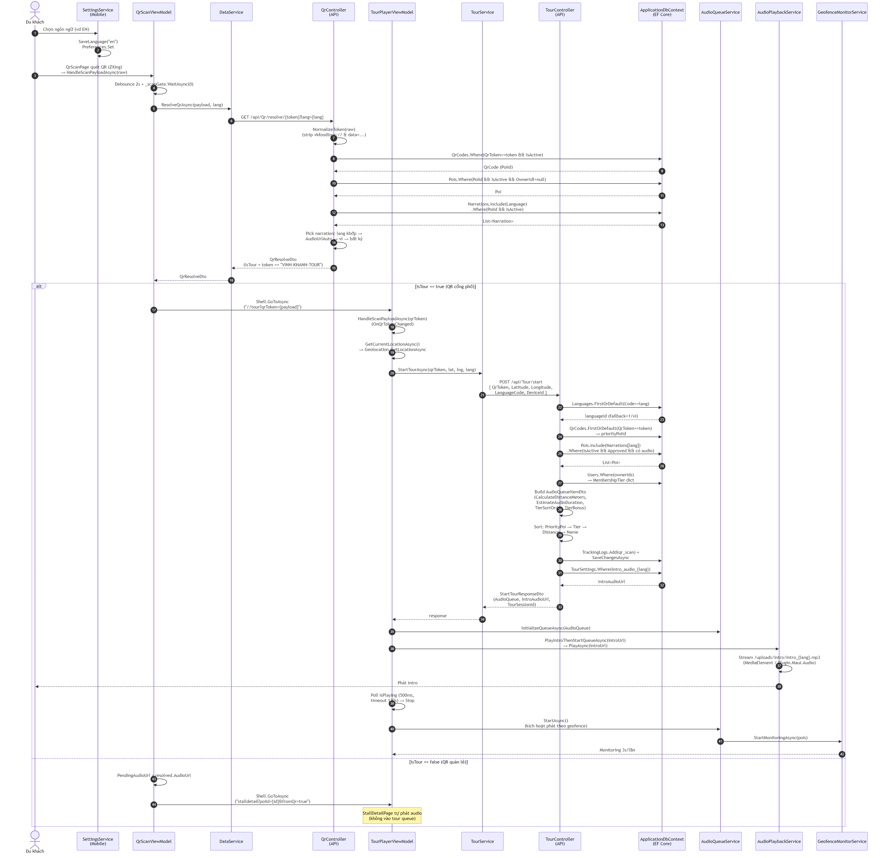

**Điểm quan trọng:**
- QR token luôn đi qua `Qr/resolve` để tránh lộ dữ liệu POI.
- Audio url là đường dẫn tĩnh `/uploads/...` (ASP.NET `UseStaticFiles`).
- `Tour/track-listen` ghi lại việc bắt đầu phát intro.

---

### 4.2. SEQ-02 – Tự động phát audio khi vào vùng geofence POI

**Mô tả:** Cơ chế geofence trigger tự động – mobile poll GPS mỗi 3s, phải ở trong vùng POI **liên tục 8 giây** (dwell) mới phát audio để tránh giật do GPS nhiễu. Khi kết thúc tự nhiên, audio kế tiếp được lấy từ queue.

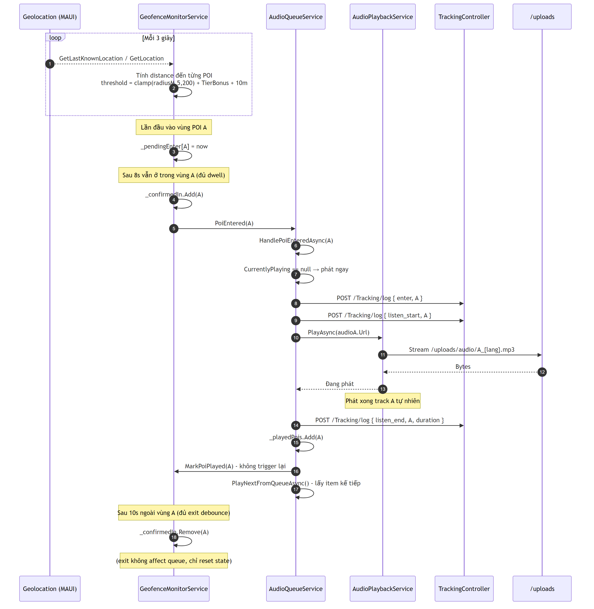

**Điểm quan trọng:**
- **Dwell 8s** ngăn false-positive khi du khách đi ngang qua quán mà không dừng.
- POI đã phát xong được đánh dấu `_playedPois` → không re-trigger dù du khách quay lại.
- Trường hợp **đứng giữa 2 geofence** được mô tả riêng ở SEQ-07.

---

### 4.3. SEQ-03 – Admin dịch nội dung POI + sinh audio bằng Edge TTS

**Mô tả:** Trên Web Admin, từ trang `ThuyetMinh.razor`, admin soạn nội dung tiếng Việt của 1 POI, dịch sang các ngôn ngữ đích (Google Translate), sau đó sinh audio (Edge TTS) và lưu file vào thư mục `UploadsData/` để API phục vụ qua `/uploads`.

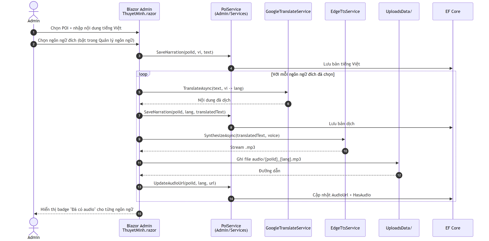

**Điểm quan trọng:**
- Hoạt động **trong Blazor Server** (không qua API runtime) – tận dụng server-side để gọi Google Translate và Edge TTS.
- Mỗi ngôn ngữ tương ứng một **voice** được cấu hình ở `QuanLyNgonNgu.razor`.
- File audio lưu vào `UploadsData/` (shared với API để phục vụ qua `/uploads`).

---

### 4.4. SEQ-04 – Vendor cập nhật gian hàng & Admin duyệt

**Mô tả:** Vendor đăng nhập cùng Blazor app, sửa thông tin quán và thực đơn. Admin duyệt trong `PoiList.razor`. Mobile app chỉ nhận POI ở trạng thái Approved qua `Poi` API.

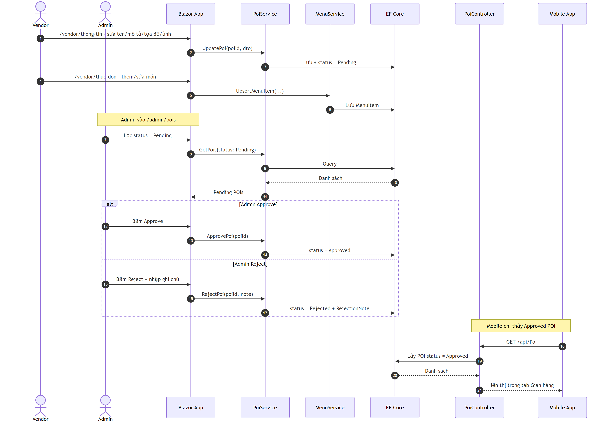

---

### 4.5. SEQ-05 – Mobile ghi log & Dashboard đọc cùng database

**Mô tả:** Du khách gửi sự kiện qua **VKFoodTour.API** (`TrackingController`). Trang Dashboard (`Home.razor`, Blazor Server) **không gọi HTTP nội bộ tới API** để lấy thống kê: nó và các widget con dùng **EF Core** (`ApplicationDbContext` / `IDbContextFactory`) truy vấn trực tiếp **cùng SQL Server** mà API ghi vào. Làm tươi “realtime” nhờ **Timer** trong widget (không dùng SignalR nghiệp vụ).

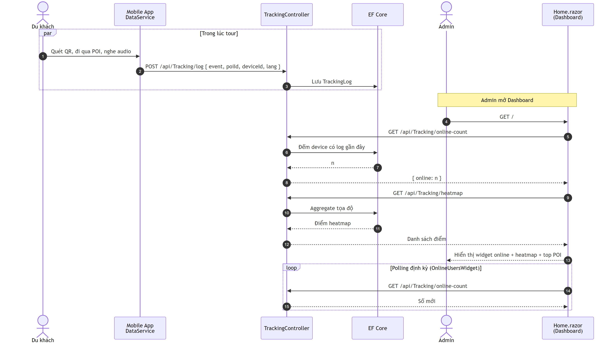

**Ghi chú:**

- **Heatmap** trên bản đồ tổng quan nằm ở `/admin/ban-do` (`BanDoPoi.razor`): cũng đọc `TrackingLogs` qua EF + đẩy JSON sang JS (`updateOverviewHeatmap`), không đi qua `GET /api/Tracking/heatmap` từ Blazor.
- Component **`OnlineUsersWidget`** cùng pattern (Timer + `IDbContextFactory`) nhưng **chưa được nhúng** vào `Home.razor`; trang chủ admin hiện dùng **`ActiveDevicesWidget`** (`WindowSeconds=45`, `RefreshSeconds=3`).

#### 4.5.1. SEQ-05a – Admin Dashboard: phương thức trong `Home.razor` & `ActiveDevicesWidget`

**Mô tả:** Chuỗi gọi **theo code thực tế** khi user role **Admin** mở `/`. File: `Admin/Components/Pages/Home.razor`, widget: `Admin/Components/Pages/Admin/ActiveDevicesWidget.razor`.

**A) `Home.razor` — `OnInitializedAsync` → `LoadAdminStats` (inject `ApplicationDbContext Db`)**

| Thứ tự | Phương thức / truy vấn |
|--------|------------------------|
| 1 | `AuthenticationStateProvider.GetAuthenticationStateAsync()` |
| 2 | `LoadAdminStats()` |
| 3 | `Db.Pois.CountAsync()` |
| 4 | `Db.Pois.CountAsync(p => p.IsActive)` |
| 5 | `Db.Narrations.CountAsync()` |
| 6 | `Db.Languages.CountAsync(l => l.IsActive)` |
| 7 | `Db.Users.CountAsync()` |
| 8 | `Db.Users.CountAsync(u => u.Role == "Vendor")` |
| 9 | `Db.TrackingLogs.CountAsync(t => t.EventType == "qr_scan" && t.CreatedAt >= today)` |
| 10 | `Db.TrackingLogs.CountAsync(t => t.CreatedAt >= today && t.EventType != "move")` |
| 11 | `listenLogs.AnyAsync()` rồi `listenLogs.AverageAsync(t => t.ListenedDurationSec!.Value)` (`listenLogs` = `TrackingLogs` lọc `listen_end`) |
| 12 | `Db.TrackingLogs` … `GroupBy`/`OrderByDescending`/`Take(5)` → `ToListAsync()` (top POI) |
| 13 | `Db.Pois.Where(...).ToDictionaryAsync(p => p.PoiId, p => p.Name)` |
| 14 | Vòng `foreach` gán `TopPoiItem.PoiName` |
| 15 | `Db.TrackingLogs` … `GroupBy` POI `listen_end` → `ToListAsync()` (top audio) |
| 16 | `foreach` gán `TopAudioItem.PoiName` (dùng `poiNames`) |
| 17 | `Db.TrackingLogs` group theo `LanguageCode` → `ToListAsync()` |
| 18 | `Db.Languages.ToDictionaryAsync(l => l.Code, l => l.Name)` |
| 19 | Build `languageStats` (LINQ trên bộ nhớ) |
| 20 | `Db.Reviews.CountAsync()` |
| 21 | `Db.Reviews.GroupBy(r => (int)r.Rating).ToDictionaryAsync(...)` → `ratingDistribution` |

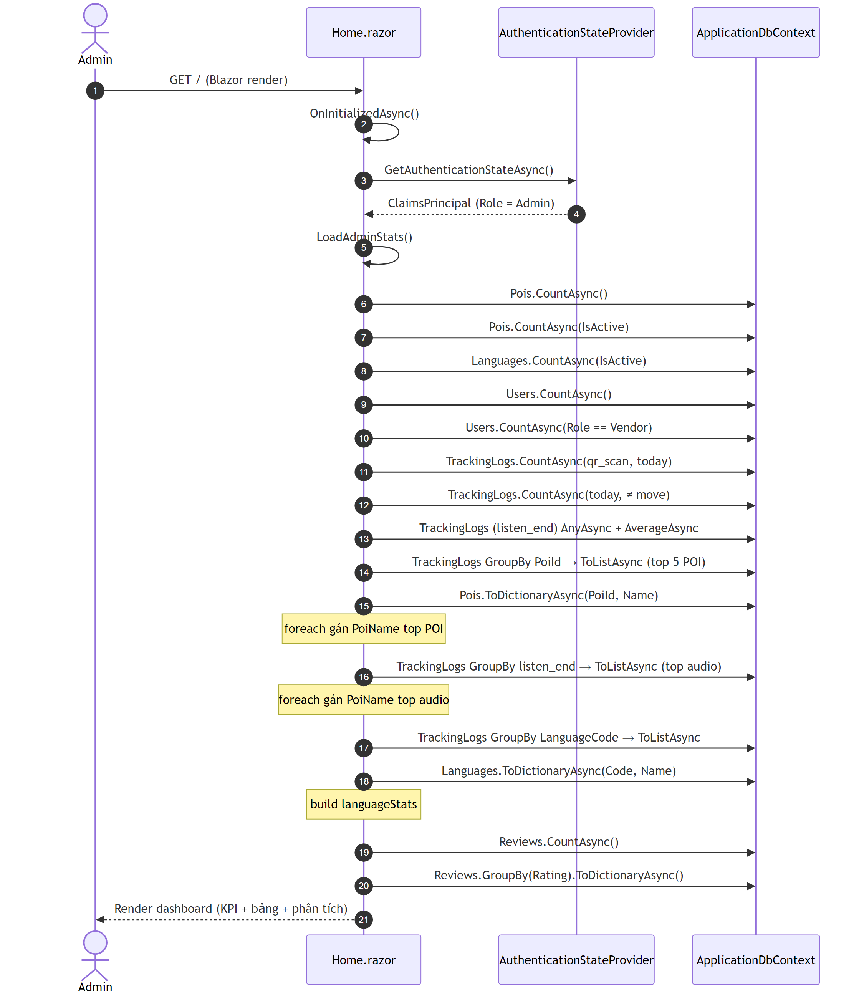

**B) `ActiveDevicesWidget` — inject `IDbContextFactory<ApplicationDbContext> DbFactory`**

| Thứ tự | Phương thức |
|--------|-------------|
| 1 | `OnInitializedAsync()` |
| 2 | `Math.Clamp(WindowSeconds, 15, 300)` |
| 3 | `LoadAsync()` |
| 4 | `DbFactory.CreateDbContextAsync()` |
| 5 | `db.TrackingLogs.AsNoTracking()…GroupBy(DeviceId)…ToListAsync()` |
| 6 | `db.Pois.AsNoTracking()…ToDictionaryAsync(PoiId, Name)` (nếu có `poiIds`) |
| 7 | Gán `activeDevices` (LINQ trên bộ nhớ) |
| 8 | `new Timer(...)` — refresh mỗi `RefreshSeconds` (3s): gọi lại `LoadAsync()` + `InvokeAsync(StateHasChanged)` |
| 9 | `new Timer(...)` — mỗi 1s: cập nhật `secondsAgo` + `StateHasChanged` |
| 10 | `DisposeAsync()` — hủy hai timer |

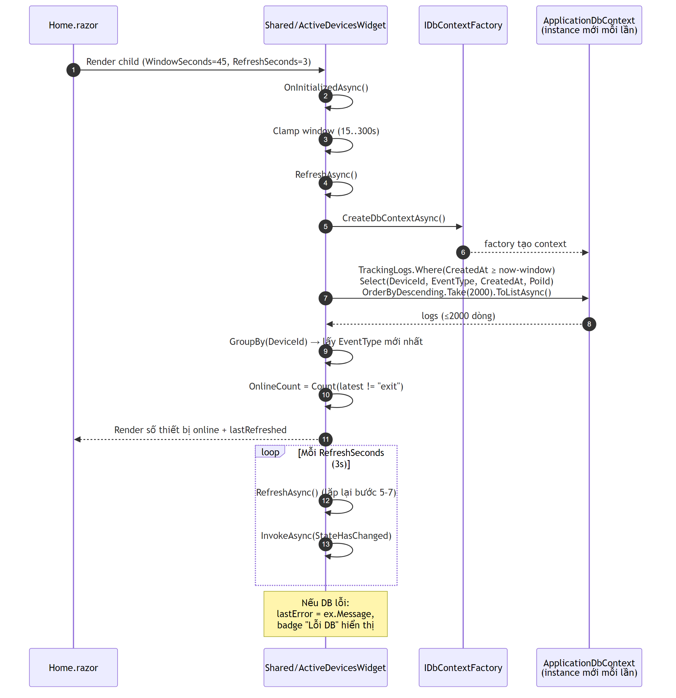

**Ghi chú thứ tự Blazor:** `Home.OnInitializedAsync` (gồm `LoadAdminStats`) chạy trước khi subtree render xong; `ActiveDevicesWidget` khởi tạo sau (lifecycle con), nên block **A** hoàn tất trước **B** trong cùng lần tải trang đầu.

---

### 4.6. SEQ-06 – Du khách đánh giá quán

**Mô tả:** Sau khi nghe audio và xem chi tiết quán, du khách có thể gửi rating + bình luận về quán.

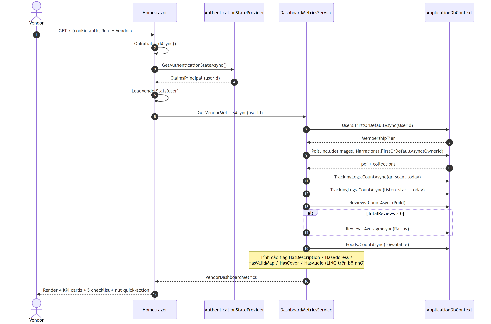

---

### 4.7. SEQ-07 – Ưu tiên audio khi đứng giữa 2 geofence chồng lấn

**Mô tả:** Kịch bản du khách đang nghe audio của POI A thì bước vào vùng geofence của POI B (2 vùng chồng lấn, hoặc 2 quán cạnh nhau). `AudioQueueService` quyết định xử lý dựa trên **tiến độ track A đang phát** so với ngưỡng **60%**.

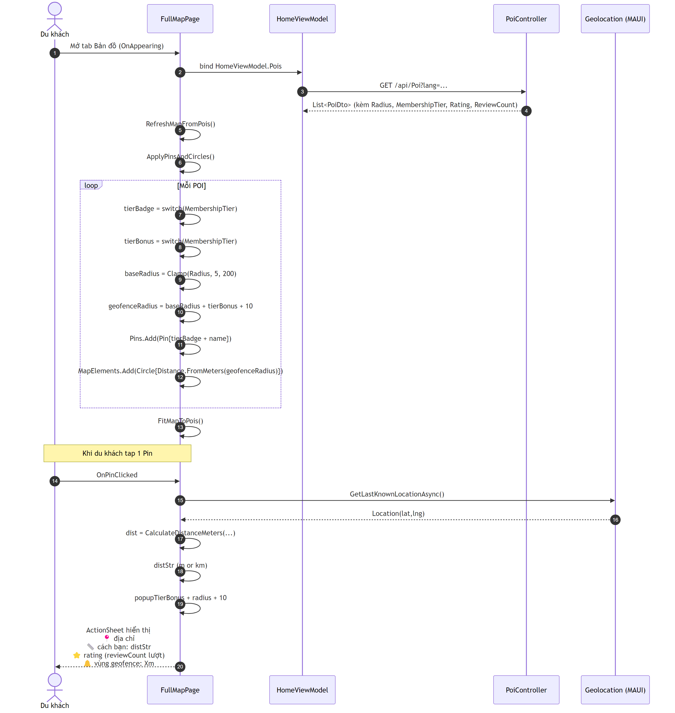

**Giải thích ý nghĩa ngưỡng 60%:**
- Với ngưỡng **≥ 60%**: track đang phát đã gần xong → cho nghe trọn vẹn để giữ trải nghiệm liền mạch, POI mới xếp kế tiếp.
- Với ngưỡng **< 60%**: du khách vừa mới bước vào quán cũ và chưa nghe được bao nhiêu, giờ đã ở gần quán mới – ưu tiên thông tin về **vị trí hiện tại**, ngắt track cũ, phát track mới, và phát lại track cũ sau khi track mới kết thúc.
- Hằng số `InterruptThreshold = 0.60` được định nghĩa trong `AudioQueueService.cs` – có thể tune để thay đổi hành vi.

**Các nhánh an toàn khác (code thực tế):**
- Nếu POI B đã có trong `_playedPois` → **bỏ qua** (không phát lại).
- Nếu POI B chính là track đang phát (`CurrentlyPlaying.PoiId == B`) → **bỏ qua** (tránh double-trigger do GPS jitter).
- Nếu `CurrentlyPlaying != null` nhưng `IsPlaying == false` (bootstrap/loading) → **InsertNext** để tránh race condition.

---

### 4.8. SEQ-08 – Pattern CRUD có duyệt (generic)

**Mô tả:** Sơ đồ **chung** cho tất cả chức năng CRUD có luồng duyệt trong hệ thống – áp dụng cho: quản lý POI, thực đơn, người dùng, ngôn ngữ, QR code, review, feedback, audio… Khi xem một chức năng CRUD trong bảng liệt kê (mục 3), tham chiếu sơ đồ này thay vì vẽ lại từng cái.

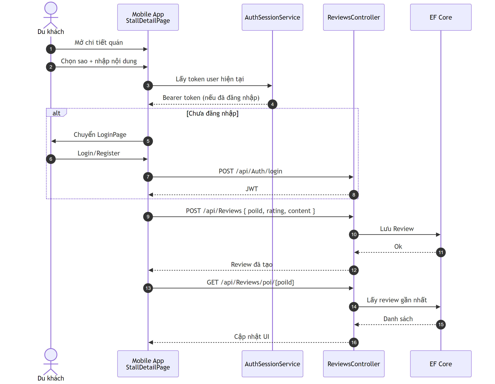

**Áp dụng cho các chức năng:**

| Chức năng | Actor | Service/Controller | File? |
|---|---|---|---|
| Quản lý POI | Admin / Vendor | `PoiService` | Có ảnh |
| Quản lý thực đơn | Vendor | `MenuService` | Có ảnh |
| Quản lý ngôn ngữ | Admin | (Blazor page) | Không |
| Quản lý QR | Admin | (`QrController` resolve) | Không |
| Quản lý người dùng | Admin | `NguoiDung.razor` | Không |
| Gửi review | User | `ReviewsController` | Không |
| Gửi feedback app | User | `FeedbackController` | Không |
| Upload audio | Admin | `EdgeTtsService` + file write | Có file |

---

### 4.9. SEQ-09 – Hiển thị Heatmap tracking trên Web Admin

**Mô tả:** Luồng tải và hiển thị heatmap thực tế trên trang `BanDoPoi.razor`. Admin bật switch heatmap, chọn mốc thời gian, UI gọi API `Tracking/heatmap`, sau đó đẩy dữ liệu sang JS interop để cập nhật lớp heatmap trên bản đồ.

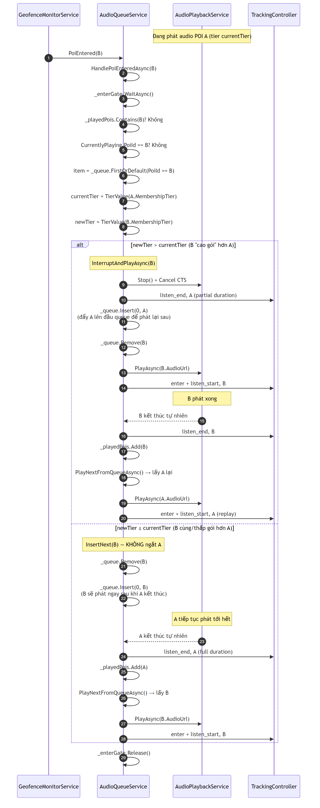

**Điểm kỹ thuật chính (đúng code hiện tại):**
- API endpoint: `GET /api/Tracking/heatmap` trong `TrackingController`.
- UI xử lý ở `BanDoPoi.razor` với các hàm `OnToggleHeatmap()` và `ReloadHeatmapAsync()`.
- JS interop: `updateOverviewHeatmap()` và `toggleOverviewHeatmap()` trong `admin-interop.js`.

---

### 4.10. SEQ-10 – Quản lý ngôn ngữ và ánh xạ TTS voice

**Mô tả:** Luồng quản lý ngôn ngữ trên trang `QuanLyNgonNgu.razor`: Admin thêm ngôn ngữ mới, cấu hình mã ngôn ngữ + voice, bật/tắt trạng thái hoạt động. Cấu hình này được dùng lại khi dịch nội dung và sinh audio thuyết minh.

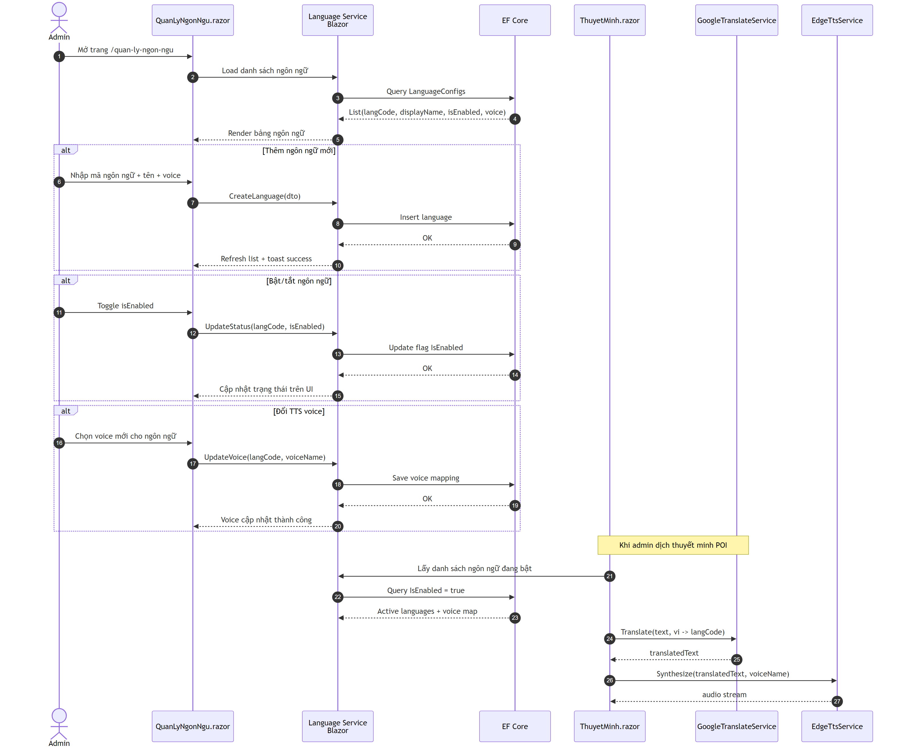

**Điểm kỹ thuật chính:**
- Trang quản lý: `QuanLyNgonNgu.razor`.
- Ngôn ngữ bật (`isEnabled=true`) là nguồn dữ liệu cho luồng dịch/sinh audio ở `ThuyetMinh.razor`.
- TTS sử dụng `voice` đã ánh xạ theo từng ngôn ngữ để đảm bảo phát âm đúng.

---

## 5. Sơ đồ Activity & State

### 5.1. ACT-01 – Hành trình du khách end-to-end trên Mobile App

**Mô tả:** Toàn bộ luồng của Mobile App từ khi mở app (WelcomePage) đến khi kết thúc tour.

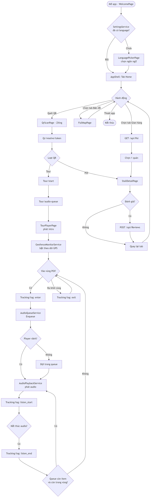

---

### 5.2. ACT-02 – Duyệt POI của Admin trong `PoiList.razor`

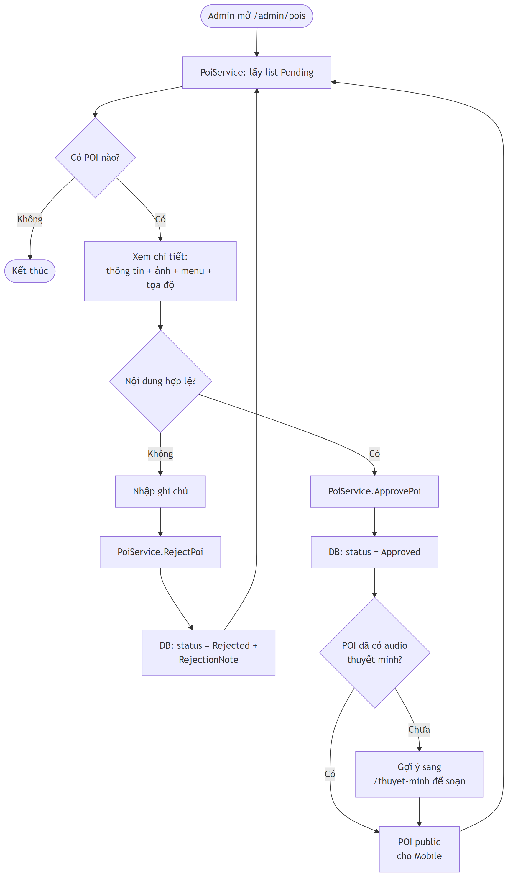

---

### 5.3. ACT-03 – Vendor cập nhật gian hàng

**Mô tả:** Vendor dùng chung Blazor app, chỉ thấy các trang `/vendor/*` theo role.

---

### 5.4. ACT-04 – Dịch & sinh audio thuyết minh trong `ThuyetMinh.razor`

---

### 5.5. ACT-05 – Logic Audio Queue với ngưỡng ưu tiên 60%

**Mô tả:** Logic thật của `HandlePoiEnteredAsync` trong `AudioQueueService.cs` khi nhận sự kiện `PoiEntered` từ `GeofenceMonitorService`.

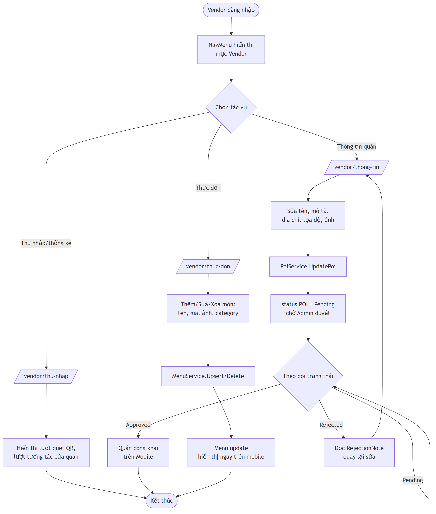

**Các hằng số tham chiếu trong code:**
- `GeofenceMonitorService.DwellThresholdSec = 8` – phải ở trong zone 8 giây mới trigger.
- `GeofenceMonitorService.ExitDebounceMs = 10_000` – 10 giây ngoài zone mới confirm exit.
- `GeofenceMonitorService.GpsBufferMeters = 10` – nới bán kính thêm 10m để bù GPS drift.
- `GeofenceMonitorService.PollIntervalMs = 3_000` – polling 3 giây.
- `AudioQueueService.InterruptThreshold = 0.60` – ngưỡng quyết định InsertNext vs Interrupt.

---

### 5.6. STATE-01 – Vòng đời (lifecycle) của POI

**Mô tả:** Sơ đồ state diagram thể hiện các trạng thái và chuyển đổi của một POI từ lúc Vendor tạo đến khi xuất hiện trên Mobile App.

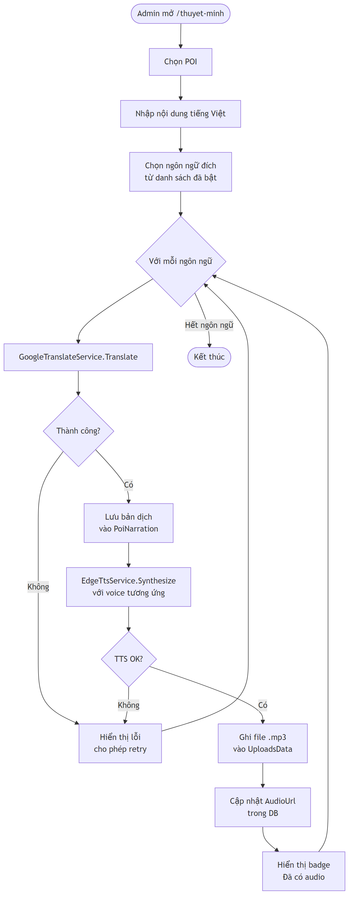

**Ràng buộc chuyển trạng thái:**
- Mọi thay đổi nội dung quan trọng của Vendor đều **reset về `Pending`** để Admin xem lại.
- POI chỉ **hiển thị công khai trên Mobile** khi ở trạng thái `Approved` hoặc `Published`.
- Chuyển sang `Archived` là **soft-delete** – vẫn giữ log tracking lịch sử.

---

## 6. Yêu cầu phi chức năng

| Hạng mục | Yêu cầu |
|---|---|
| Hiệu năng | API < 500ms cho các request chính; audio trigger theo geofence trong vài giây. Có sẵn `load_test.js` và `stress_test.js` để kiểm thử tải. |
| Bảo mật | Cookie auth + Google OAuth cho Admin/Vendor; JWT cho Mobile (`AuthController`); mật khẩu hash; static files phục vụ qua `/uploads`. |
| Khả dụng | App không crash khi API lỗi – `DataService` có `FallbackDemo()` để hiển thị dữ liệu tối thiểu. |
| Đa ngôn ngữ | Thêm ngôn ngữ trong `QuanLyNgonNgu.razor` → sinh audio là có thể sử dụng, không cần build lại app. |
| Tracking | Mọi hành vi chính (`qr_scan`, `enter`, `exit`, `listen_start`, `listen_end`) đều được ghi qua `Tracking/log` cho heatmap và thống kê. |

---

## 7. Phụ lục

### 7.1. Danh sách event tracking (Mobile → `Tracking/log`)
- `qr_scan` – quét QR đầu phố hoặc QR quán.
- `enter` / `exit` – vào / rời vùng geofence POI (sau dwell 8s / debounce 10s).
- `listen_start` / `listen_end` – bắt đầu / kết thúc phát audio (kèm `ListenedDurationSec`).
- `move` – heartbeat vị trí (phục vụ heatmap & đếm thiết bị online); luôn kèm `LanguageCode` đã chuẩn hoá.

### 7.2. Danh sách API chính

| Controller | Endpoint | Mục đích |
|---|---|---|
| `AuthController` | `POST /api/Auth/login`, `/register` | Đăng nhập/đăng ký du khách (role User), trả token + user info |
| `PoiController` | `GET /api/Poi?lang=`, `GET /api/Poi/{id}?lang=`, `GET /api/Poi/{id}/detail?lang=` | Danh sách / chi tiết POI đã localize theo ngôn ngữ; chi tiết kèm menu, ảnh, narration, audio URL |
| `LanguagesController` | `GET /api/Languages` | Danh sách ngôn ngữ active đã có TTS voice |
| `QrController` | `GET /api/Qr/resolve/{token}?lang=` | Resolve token QR sang tour hoặc POI |
| `TourController` | `POST /api/Tour/start`, `GET /api/Tour/audio-queue?tourId&lang`, `POST /api/Tour/track-listen` | Bắt đầu tour, tải audio queue, log start/end nghe audio |
| `TrackingController` | `POST /api/Tracking/log`, `GET /api/Tracking/online-count?minutes=`, `GET /api/Tracking/heatmap?hours=` | Ghi log (server normalize `LanguageCode`), đếm thiết bị online, heatmap dạng bucket toạ độ |
| `ReviewsController` | `GET /api/Reviews/recent?take=`, `GET /api/Reviews/poi/{poiId}`, `POST /api/Reviews` | Danh sách review + tạo review |
| `FeedbackController` | `POST /api/Feedback/app` | Gửi feedback ứng dụng |
| `SyncController` ⭐ | `GET /api/Sync/bootstrap?since=` | Snapshot offline: ngôn ngữ active + POI Approved + ảnh + audio URL cho mobile cache |

### 7.3. Thành phần dự án
- `Admin/` – **Web Admin + Vendor** (ASP.NET Core **Blazor Server**), phân quyền theo role `Admin` / `Vendor`.
- `VKFoodTour.API/` – ASP.NET Core Web API (JWT), phục vụ static files `UploadsData/` qua `/uploads`.
- `VKFoodTour.Application/` – project dự phòng cho layer Application (hiện tại gần như trống, logic đặt trực tiếp trong API controller và `Admin/Services`).
- `VKFoodTour.Infrastructure/` – `ApplicationDbContext`, Entities, Migrations (EF Core).
- `VKFoodTour.Shared/` – DTO dùng chung: `PoiDto`, `PoiDetailDto`, `TourDtos`, `AuthDtos`, `ReviewDtos`, `TrackingDtos`, `QrResolveDto`, `LanguageListItemDto`, `AppFeedbackDtos`.
- `VKFoodTour.Mobile/` – App **.NET MAUI** (ZXing QR, Maui Maps, Plugin.Maui.Audio) với `DataService`, `AuthSessionService`, `SettingsService`, `LocalizationService`, `FavoriteService`, `HttpImageService`, `AudioPlaybackService`, `AudioQueueService`, `GeofenceMonitorService`.
- `VKFoodTour.Mobile.Core/` – Core library dùng chung (chứa `PoiApiService` như bản thay thế tương lai).
- `Database/VKFoodTour.sql` – script DDL + seed.
- `UploadsData/` – chứa file ảnh và audio sinh ra từ Edge TTS.

---

_Tài liệu này là bản đặc tả yêu cầu sản phẩm (PRD) cho hệ thống VKFoodTour, phục vụ mục đích phát triển, nghiệm thu và báo cáo đồ án._

